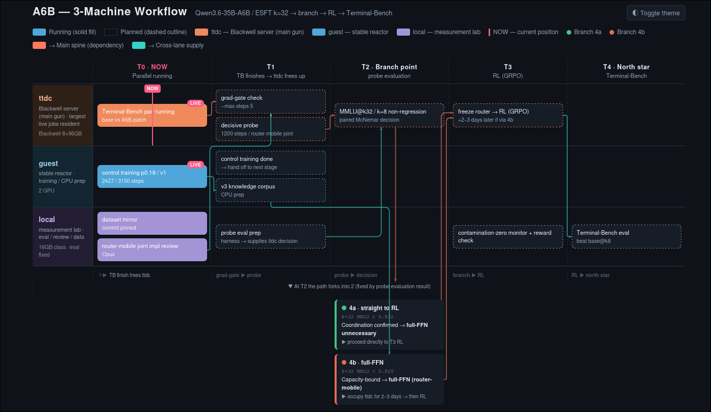

# DEVLOG — Qwen3.6-35B-A3B → A6B (k=32) 強化キャンペーン

**大目的**: Qwen3.6-35B-A3B(MoE、総35B / active 3B、256 experts/層、native top-8)の推論時 top-k を 32 に引き上げた「35B-A6B」を作り、知能・一貫性・コーディング/agentic の3軸で base(k=8)を統計的有意に上回る。北極星 = Terminal-Bench。ハードゲート = ベンチ汚染ゼロ、汎用非劣化、数字は (n, same-condition, CI) 付きのみ。

**測定規律**: 同一条件 A/B + paired McNemar + cluster bootstrap。shuffle seed 0 固定。measured と hypothesized を区別。負の結果も記録する(むしろ律速項を指す clue として歓迎)。

---

## 2026-07-02 — 構想確定・ターゲット転回

- ターゲット選定: クラウド前提の候補を棄却し、**全工程がローカルで回る Qwen3.6-35B-A3B に確定**(訓練 trainable 1.5-4.8B、2×RTX PRO 6000 で完結)。
- 手法確定: **top-k 拡張 × ESFT(Expert-Specialized Fine-Tuning, 2407.01906)の合わせ技**。routing 頻度上位の expert FFN だけを delta(残差)方式で訓練、router は凍結。
- 文献テーゼ: 「naive な k 増は効かない/壊れる(EMoE 2509.21892, Matryoshka 2509.26520)+ 増やした容量は訓練して初めて効く」— この2段目がうちの計画そのもの。

## 2026-07-02/03 — Phase 0: 訓練基盤実装

- `esft/` 実装。**Qwen3.6 MoE の要注意事実**: experts は packed 3D Parameter(`gate_up_proj (256,1024,2048)`)なので requires_grad で凍結できない → grad hook で非選択 expert 行ゼロ化 + expert 群 wd=0。bit-exact 凍結を CPU で実証。
- delta 方式で trainable 32B→2.46B(勾配 64GB→4GB)。スモーク 22/22。
- 敵対レビューが FATAL を発見: train_esft が k=8 のまま訓練(rank9-32 に勾配が流れない)→ k=32 override 実装で修正。
- gate-mass 分析: 追加 rank9-32 が renorm gate 質量の **54.0%** を運ぶ(rank1-8=46%)。「4倍容量は名目だけ」を否定、k=32 の妥当性を実測で支持。

## 2026-07-03 — pilot 2本と方向転換

- math ESFT@32 pilot(300 step): GSM8K が base@8≈0.90 の near-ceiling で**非情報的**。教訓: headroom の無いベンチで効果測定するな。
- ユーザ方向づけ: 「なぜ数学にこだわる、コーディングが一番」→ coding 優先へ。**北極星 = Terminal-Bench 確定**、比較の物差しより「到達可能な最強を作る」(build, don't compare)。
- coding pilot で **AdamW OOM → Adafactor 解**(delta 方式は optimizer state 律速: AdamW 8B/param ≈ 19.7GB。Adafactor で state ~0)。
- 良質データ 13本 DL(Terminal-Corpus、When2Call、OpenCodeReasoning-2 等、license 全確認)。Claude セッションログのリークデータ(いわゆる Fable traces)は品質・法務両面で **REJECT**。

## 2026-07-04 — agentic SFT 完走・2つの壁を実測で分解

- **VRAM 壁の真因 = CE loss の logits 実体化**([seq×vocab 248320] fp32、seq8192 で 8.1GB)。attention でも linear-attn でもない(fla を疑ったのは早合点=盛り、traceback を読めば一発だった)。**Liger FLCE 統合**で解決(FLCE vs 参照 CE |diff|=1.19e-7)。
- **RAM 壁**(63k 軌跡のトークン化で 120GB) → int32 streaming pack で 25GB に。
- agentic SFT 本走: Terminal-Corpus 63,621 軌跡(SWE-bench_Verified + TB2 exact-match decontam 0 drop)、DDP seq7168、509 step 完走。patch 4.9GB。
- vLLM SM120 修理(cu130 nightly + flashinfer JIT の5段障害潰し)、単発 176.7 tok/s (n=1, cold, k=8, TP2)。

## 2026-07-05 — RL 基盤・データ考古学

- SWE-RL(2502.18449)verbatim 報酬関数(48 tests)。**SWE-smith-trajectories の patch 列は破損(shuffle、repo 一致 2%)を発見** → gold patch を instance_id join で再構築(300/300 整合)。RL データ v1 = 5,175件、decontam 0 drop。
- INC-0 rollout 384×8: lenient bo8 = **0.621**(rejection-FT の弾薬は十分)。
- **形式問題の真因特定**: Qwen template は gen prompt 側が `<think>` を供給する(モデルは開始タグを書かない)→ **assistant prefill `<think>\n` が解**(paired Δlenient +0.394 CI[+0.148,+0.647])。GRPO では prefill 再結合が必須要件。

## 2026-07-06 — 混合コーパス mixed_v1・eval インフラ完成・訓練起動

- **mixed_v1**: 415.9M tok(agentic 64 / coding 12.3 / toolcall 11.2 / math 10.2 / 封筒 2.3%)。汚染ゲート4層(word-13gram ∪ 正規化 exact ∪ 短問題 containment ∪ HE entry_point 署名 purge ∪ TB instruction 本文 178 exact ∪ JMMLU JP≥5 shingle)で**残留 0**。JP filter(JP/CJK≥10 で drop)ハードゲート化。
- Phase1 cache の破損(retroactive think strip → user ヘッダ欠落)を **preserve_thinking one-shot render** で修正、invariant スキャナで検証。
- eval 側: MMLU は think 溢れ trunc が測定を壊す → **choice-logprob 化**(hidden+lm_head 手動適用、full logits 64.5GiB OOM 回避)。MMLU first-N のアルファベット順偏り → shuffle seed 0。
- 訓練起動: aux-host 2×PRO6000、seq7168 / fused-CE / Adafactor / grad-accum 8 / 3150 step。幽霊 2.5GB VRAM リークで p0.2(833 experts)が OOM → **p0.18(730 experts)で稼働**。
- 運用事故と対策: 二重起動事故・eval wedge 7時間沈黙 → **起動権限を main に一本化、agent は read-only 監視、30分 heartbeat 常設**。pgrep 自滅 3回 → bracket パターン必須。

## 2026-07-07 — eval matrix 完成間近・k8>k32 問題・coding patch の死・文献検証

### eval matrix 完成(n=600 intel / 164 HE / 500 MBPP、paired McNemar)

| アーム | MMLU | GSM8K | HumanEval | MBPP |
|---|---|---|---|---|
| base@k8 | **0.843** | **0.893** | 0.866 | 0.866 |
| base@k32 | 0.807 | 0.865 | 0.841 | 0.792 |
| patch(agentic)@k32 | 0.813 | 0.885 | **0.902** | 0.828 |
| coding特化@k32 | 0.805 | 0.820 | 0.762 | 0.718 |

**base@k8 比 paired McNemar(北極星は「base@k8 に有意勝ち」)**:
- patch@k32 vs base@k8: MMLU −3.0(p=.010 **負け**)/ GSM8K −0.8(p=.49 **引分**)/ HumanEval +3.7(p=.31 **引分**)/ MBPP −3.8(p=.027 **負け**)
- **正直な現在地: agentic patch はまだ base@k8 に有意勝ちしたベンチが1つも無い**(2引分・2負け)。これまでの「勝ち」は全て vs base@k32(naive)相手。base@k8 超えは混合訓練(走行中)+ INC-0/GRPO の宿題。
- coding特化@k32 は全ベンチで base@k8 に有意負け(MBPP −14.8pt)。ドメイン特化 patch 路線の死を再確認。

- **発見1: naive k32 は知識系を実劣化させる**(MMLU −3.7pt / GSM8K −2.8pt vs k8)。agentic patch は部分回復(GSM8K p=.029 有意、vs base@k32)+ HumanEval で有意勝ち(p=.041 vs base@k32)。**複雑タスクほど転移**。
- **発見2: coding 特化 patch は全面失敗**。GSM8K 0.820(base@k32 にすら p=.002 有意負け)、HumanEval 0.762(agentic patch に p=.0001 大敗)。**機構 = 生成長の転写**: median 186 tok(base 2588 / agentic patch 1064)で reasoning が焼き殺された。静的コード 111k の「問題→即答」形式がスタイルごと転写された。**教訓: SFT は能力より先に振る舞いを書き換える。ドメイン特化 patch 路線は死、混合+agentic が本線。**
- **発見3: agentic patch は「良い圧縮」**。base の 1/3 の思考長で最高精度 + 途切れ解消 + 実質3倍速。
- **gpu-host 編入**: 8×RTX PRO 6000(768GB VRAM)提供を受け、大規模側の計算制約が消滅。venv/repo/cache 配備済(HF DL は HF_HUB_DISABLE_XET=1 必須の罠)。
- **外部リサーチの敵対検証**(Grok 報告 → Opus 8体 + Fable 判定): 幻覚 arXiv ID ゼロ、ただし盛り/誤読 5件(ESFT「FFT 9pt+劣化」は実際 −3.6pt、replay 相場 10-30% は実際 1-5% で足りる、他)。**戦略級知見: (a) Matryoshka 論文が Qwen3-30B-A3B を直接測って k 変更の急劣化を示す(うちの実測と整合)(b) 弾性訓練でも実証レンジは native の 2-3×= k=32(4×)は文献の外の extrapolation**。GSPO は「ほぼ必須」ではなく、うちの RL v1(on-policy 1-step、router 凍結)は問題を構造的に半分回避済み。vLLM #36872(姉妹モデル FP8 + native MTP で accept 61%→0% 崩壊)= MTP graft は再現ゲート先行。
- **決定(ユーザ裁定)**: ①gpu-host 投入は corpus v2(replay 2-4%: Nemotron chat/science、汚染ゲートフル再走)完成後 → p0.2 本走。aux-host p0.18/v1 は完走させ corpus×expert 予算の A/B に。②ローカル次弾 = k sweep(base@k16/k24)→ ckpt600 知識回復チェック → TB2.0 3アーム夜間。

### 3台運用ドクトリン v1(2026-07-07、ユーザ提起で策定)

役割固定: **gpu-host = 主砲**(GPU数が効く律速工程のみ: 訓練本走/GRPO/大量rollout/pack)、**aux-host = 安定炉**(長時間単発ジョブ、A/B control 腕、データ工場 CPU)、**ローカル = 計測室**(全 eval + TB。測定環境をここに固定して same-condition を守る。ユーザ優先)。

選択基準(上から順に): ①律速工程に最強リソース、律速外に gpu-host を使わない ②役割表を破る時は理由を DEVLOG に書く ③重い run の前に必ず安いゲート(INC-0 原則)④1 GPU 1 ジョブ・訓練同居禁止・**空き GPU を埋めるための仕事は作らない**(遊休には安く独立な保険仕事のみ)⑤同格なら「早く次の判断をくれる」実験を優先 ⑥起動権限 main 一本化・借り物の作法。

### corpus v2 replay レーン(2026-07-07、検証合格)
- Nemotron-Post-Training の chat/science split から replay レーン2本: general 8.0M tok(5,790 recs)+ knowledge 4.0M tok(2,139 recs)= mixed_v1 の 2.89%。文献の 1-5% band 内。
- **Fable 独立検証**(agent 自己申告を裏取り): decontam.py audit 再走で両レーン residual 0、JP≥10=0、スキーマ純度 100%。生成長 median general 4.5k / knowledge 5.2k 字 = coding patch を焼き殺した即答186tok の真逆で、reasoning-heavy な振る舞いを補強する側。
- 裁可: system_prompt 非注入(Llama-Nemotron 制御トークンは Qwen に異物)/ reasoning on-off 両保持 + `<think>` verbatim / 加算 merge(415.9M→427.9M)。
- **honest note**: knowledge レーンは MMLU-style 科学多肢選択。decontam は exact/13gram/containment のみで **paraphrase レベルの近似は構造上スコープ外**(コーパス全体に共通の既知限界)。embedding-sim 硬化を追加するかはユーザ裁定待ち。

### gpu-host 8-GPU: mixed_v2 p0.2 本走 起動(2026-07-07 07:00 JST)
- **probe8 で p0.2(833 experts、trainable 2.62B)が 96GB/GPU に収まることを実測**(aux-host では幽霊リークで不可だった)。8-rank NCCL 正常、**21.6 s/step**(aux-host 2-GPU 78.8 の 3.65倍)。
- **転送の壁と大技**: aux-host→どこでも 0.9 MB/s(borrowed 機の住宅回線 上り≈7Mbps、tailscale は direct で relay ではない=物理限界)。mixed_v2 生 4.2GB を送ると 78分。**回避 = mixed_v2 の 99%(v1 部分)は既に gpu-host に packed cache で存在**。新規は replay 2レーン 54MB だけ → それだけ zstd 転送(31秒)→ gpu-host で pack(7929rec→1440 blocks、6秒)→ 既存 v1 cache と torch.cat → mixed_v2 cache(59468 blocks、supervised 62.3%、manifest 整合)。**4.15GB の転送を回避**。
- 起動: 8-GPU DDP、seq7168 / fused-CE(FLCE)/ Adafactor / ga2 / p0.2 config / 3150 step / save300。全GPU 94-100%・90.5GB。ETA ~19h。runs/mixed_v2_esft_k32_p02。
- **これで aux-host(p0.18/v1、55h)と gpu-host(p0.2/v2、19h)の2本が並走** = expert 予算(0.18 vs 0.2)× corpus(replay 有無)の best-shot アーム。build-the-best 方針で、最終は base@k8 比で判定。
- 運用教訓: 転送チェーンを2本同時に走らせて aux-host 回線を食い合い共倒れ + audit 起動 ssh の `&` が返らずスクリプトがハング → 両方 kill して単一目的の綺麗な転送に。**細い共有リンクでは転送は直列化・単一責務に**。

### Terminal-Bench 北極星ベースラインのハーネス修理(2026-07-07)
前セッションの base_k8 TB run が「0/24 solved + 12 error」で放置されていたが、解剖したら**有効な測定ですらなかった**。系統的にバグを剥がした:
1. **12「エラー」= SIGTERM キャンセル**(exception.txt が `_handle_sigterm→KeyboardInterrupt`)。前回セッションが run を kill しただけ、`finished_at: null` の未完。0/24 は幻。
2. **port 18000 = 前セッションの死んだ SSH トンネル**(aux-host:8000 宛、今は訓練中で無応答)。ローカル serve は 8001 → ハーネスを 8001 直叩きに変更。
3. **NotFoundError = モデル名不一致**(local serve `qwen36a3b` vs ハーネス `Qwen3.6-35B-A3B`)。serve を `--served-model-name Qwen3.6-35B-A3B` に統一。
4. **RuntimeError = Docker イメージ pull の transient reset**(IPv6 経路で大レイヤが `connection reset`)。ubuntu:22.04 が retry で通ることを確認 → transient と判定、再走で通過。
5. **AgentTimeoutError = モデルが遅いだけ**。trajectory 精査で **base@k8 は実際に賢く駆動していた**(llm-inference タスクで 174 step / 20 コマンドバッチ、ファイル読み→Python 実行→baseline_packer 解析まで到達)。reasoning 重めで default timeout に間に合わず。→ `--agent-timeout-multiplier 3.0` で完全ベースライン起動。
**教訓: 「0/24」を「モデルが弱い」と読まず解剖したのが正解**(memory の「壊れると『モデル弱い』と誤読」警告どおり)。ハーネスは生きていた。runs: base_k8_full(89タスク、n_conc4、timeout 3x、夜間)。serve=serve_bf16.sh 8(TP2、8001、Qwen3.6-35B-A3B)。

## 2026-07-08 — gpu-host v2/p0.2 完走・知識系初判定

- **訓練完走**: 3150 step / 18h20m / rc=0 / peak 91.55GiB(probe 予測どおり)/ 20.96 s/it。patch 5.2GB(1666 tensors = 833 experts)。best step 3100 の ckpt は save 間隔の狭間 → 最終 3150 の重みを patch 化(eval_loss ほぼ同値)。
- **知識系判定(gpu-host 同一マシン paired、n=600、choice-logprob)**:
  - MMLU: base@k8 0.840 vs **v2patch@k32 0.820**(−2.0pt、p=0.14 **引き分け**)
  - GSM8K: base@k8 0.887 vs **v2patch@k32 0.865**(−2.2pt、p=0.26 **引き分け**)
- **解釈(honest)**: naive k32 は MMLU で有意負け(p=.002)だったのが、v2 混合+replay で**統計的引き分けまで回復**。ただし「勝ち」ではなく、点推定は依然 −2pt。GOAL の非劣化ゲート(MMLU −1pt 以内)は点推定で未達(CI [−4.4, +0.4] で判定保留)。GSM8K は v1 agentic patch(local 0.885)から数値上の上積みなし — **replay 1-5% では知識ギャップを閉じ切れない可能性**が濃くなった。次の診断 = ckpt 軌道(900/1800/2700)で「まだ伸びてる途中」か「頭打ち」かを判定 → 頭打ちなら full-FFN エスカレーション条件に接近。
- 並走中: v2patch と base@k8 の code 系(HE/MBPP)を gpu-host GPU4-7 で測定中。TB base@k8 は 54+/89(solved 0 継続)。
- cross-machine 注記: base@k8 は gpu-host で MMLU 0.840 / GSM8K 0.887(local 0.843/0.893)— マシン間で −0.3〜−0.6pt ずれる実測。**同一マシン paired の再測定は正解だった**。

### 走行中(2026-07-07 07:00 JST)
- gpu-host: mixed_v2 p0.2 本走 8-GPU(上記、step 0→、ETA 19h)
- aux-host: mixed_v1 p0.18 本走 step ~600/3150(corpusv2 解放で CPU 競合解消、78s/it に復帰見込み)
- ローカル: k sweep(k24 測定中、k16=MMLU 0.828 確認済)
- 保留: layer1 domain別 NLL(ckpt300/600、転送競合で中断→gpu-host 本走後に再開)

## 2026-07-08 (2) — TB 北極星ベースライン確定・serve 環境の壁

- **TB2.0 base@k8 = 0/89 (0.0%)**(timeout 3x、n_conc4、ローカル TP2 serve)。内訳: 時間切れ49(55%)/検証不合格37/その他3。素の base は長考癖(数千tok/問)が多ターン端末対話で複利になり時間の壁に溺れる。NVIDIA の素 Qwen3-32B=3.4%→特化後27.4% と整合する「伸び代最大」の出発点。
- **測定設計の修正**: 時間切れ支配のベンチでは serve 速度が混入 → ペア比較は両アーム gpu-host(同一 serve 構成)で再走する。ローカル run はハーネス実証+死因分析として役割完了。
- **gpu-host vLLM serve の壁(pip wheel × SM120 × flashinfer JIT)を解体中**: ①nvcc 無し→venv 同梱 cu13 tree を CUDA_HOME に ②ninja→venv bin を PATH に ③cccl の判定式(nvcc 版 == cudart ヘッダ版)を実物で読解 ④sm_120f 要求→ **nvcc/crt/runtime を 13.3 で完全統一 + JIT cache 空から**。教訓: 版当てゲームでなく判定式を読む。
- v2 の最終判定確定: ckpt1200 ≈ final(タイ)、HE は base@k8 と完全同点(12:12)。MBPP スタイル転写は step1200 で焼付き済み=SFT では直らない → INC-0/GRPO(on-policy)の領分と確定。serve 候補 ckpt1200、merged 済み。

## 2026-07-08 (3) — GRPO 実装完了 + RL 文献検証(Opus3体、幻覚ID 0/22)

### GRPO 更新ループ([T]フェーズ)実装・検証済み
- rl/grpo_train.py(Opus実装、Fable が test_grpo.py 14/14 を独立実走で緑確認)。group advantage、completion logp、**KL参照=delta-toggle-off(70GB複製不要)**、loss=-(adv·logp_sum)+β·KL、on-policy 1-step(GSPO系列比は拡張点)。**勾配が router/非選択expertに流れないことをテストで確定**(MoE-RL崩壊の構造回避)。prefill再結合 byte一致。

### Grok RL リサーチの敵対検証(3体、全22論文 CONFIRMED、幻覚ID=0)。設計への判定:
- **router 凍結 = 維持でOK(文献的に劣位でない)**。「freeze劣位」は RSPO(2510.23027、MSRA)単一論文の self-claim で R3と未比較。決定的反証: **GSPO(2507.18071)自身が「token-level MoE RL には Routing Replay(≈router固定)が収束に必須」と明言**=凍結類似の安定化が必要が共通認識。我々は router を動かす意図がない(ESFT)ので「adaptability犠牲」は非該当。安い保険=multi-epoch時のみ GSPO系列比に切替(実装済拡張点)。
- **⚠️実装変更: Dr.GRPO(2503.20783)の「std正規化=difficulty bias」は査読付き・再現済みの本物**。我々の adv=(r-mean)/std は該当。→ **--adv-norm {std,mean} を追加**(default std維持、mean=Dr.GRPO は opt-in、同一条件A/Bで測る。無条件レバーとして盛らない=主効果はtoken効率/gradient bias除去であり勝率↑保証でない)。commit済。
- **🔴仮説の修正(重要): 「RL で増えた容量を活性化し SFT の頭打ちを超える」は文献がほぼ全会一致で否定**。(a)MoE-GRPO(2603.24984)の「dormant expert活性化」=Grokの盛り(実物は1B VLM/8expert、entropy 1.05→1.82は本物だが"眠り起こし"は論文に無い)。(b)Yue(2504.13837 CONFIRMED): RLはbaseのpass@kを超えない=**天井はRLで動かない**。(c)Jin(2509.12235 CONFIRMED): RLはSFT後期のOOD忘却をhealするだけ、**SFT初期ピークを超えない**。(d)「active増→RL伸びしろ大」の定量文献=NOT_FOUND。→ **設計原則を組替: 容量(24-expert表現力)はSFTで獲得、RLはそれをelicit/heal/安定化する装置**。−2pt頭打ちを本気で削るなら文献の含意はRLでなくSFT側(full-FFN/蒸留)。ユーザ仮説「アクティブ増やすほどRL重要」は否定でなく精密化(RLが引き出せるのは既にある容量なので拡張は前提条件、ただし天井押上げは期待するな)。
- 使える確定知見: SWE-RL(2502.18449)報酬設計は直接参照(41% Verified、OOD数字 HumanEval+ 79.9 vs base76.2/SFT73.2、MMLU 86.82維持=真)。Xiong(2504.11343): rejection-FTのentropy collapse実証(GRPOの主利点は「全誤りprompt implicit filtering」)→INC-0は1反復+多様性制御。DAPO/AVSPO(2605.21125実在)は collapse対策の予備。SSR(2512.18552実在、self-play +10.4)は将来。
- report=reports/GROK_RL_RESEARCH_REPORT.md、検証はsession subagents。

## 2026-07-08 (4) — 順番の再定義(router可動 joint)+ ワークフロー図

### Grok(grok-4.3)3往復相談 → 天井診断の順番が変わった
- **診断**: 選抜delta+router凍結の MMLU 0.820 頭打ちは、**容量天井でなく router 較正(協調)問題の可能性**。追加24 expert の gate 質量54%を制御するのは router だけで、凍結中は tail を再重み付けできない。∴ 今の安いゲート(router凍結+kランダム)は**交絡**していて診断に使えない。
- **順番の再定義**: ①癒やしSFTの中で router を expert と**同時(joint)**に動かす(先でも後でもない)。我々は「凍結routerに対しexpert最適化」= 間違った丘を登っていた。0.820平坦はその天井であって真の天井でない。②**full-FFN は「router可動でもなお容量不足なら」の後段エスカレーションに降格**(旧「選抜delta vs full-FFN」フォークは誤り、Grok Q2: full-FFN+凍結routerは最弱)。③RLは router を固めた最後(GSPO Routing-Replay 安定性)。
- **安さの鍵**: router logits は top-k 選択の *前* に softmax されるので **k非依存**。「k=8アンカー」= router 分布全体を base に近く保つ、を**毎ステップ1回**で計算でき二重forward不要。

### 実装: router可動 joint モード(flag-gated、Opus実装 / ローカル実走テスト5/5 PASS)
- `--train-router` / `--router-lr-mult 0.08` / `--router-anchor-weight 0.15`。router(gate)解凍 + 低LR独立param group + base-anchor KL(F.linear(x,gate.weight) vs 凍結snapshot、grad-checkpoint安全にx再計算)。既存の凍結/delta/FLCE/kランダム経路は全て非破壊。router クラス実測: `Qwen3_5MoeTopKRouter` weight(E,H) bias無、softmax over 256 → top-k。**未配備**(gpu-host TB完走→grad-gate直前に配備)。
- **hypothesized(未実測)**: LR 0.08× / λ=0.2 / anchor=0.15 / 期待0.828–0.835 は Grok の転移値。probe で 100step sweep、鵜呑み禁止。arXiv ID群も未検証。

### kill基準(1200step 1発の決定的 probe)
| k=32 MMLU | k=8劣化 | 分岐 |
|---|---|---|
| ≥0.832 | ≤0.008 | 4a: 協調確定→full-FFN不要、RL直行 |
| 0.825–0.831 | ≤0.008 | Elastic補助lossで延長 |
| <0.825 | — | 4b: full-FFN(router可動, 2-3日) |
| any | >0.015 | 中止・router再凍結(RL安定性優先) |

### ワークフロー図(3マシン時系列)

インタラクティブ版: `esft/workflow_timeline.html`(日) / `esft/workflow_timeline_en.html`(英)。左→右=時間、横レーン= gpu-host(Blackwell主砲8×96GB)/ aux-host(安定炉2GPU)/ ローカル(計測室・eval)。曲線矢印で依存(暖色=主系列/ティール=横断供給)。T2 の eval判定は gpu-host レーン(高速)。

## 2026-07-10 — B2 step 1000完走・G0d最終回収

- **TTDC B2継続学習完走**: G1 B2(v3 + forward KL β=0.5、teacher k8 top-64、router凍結)をcheckpoint-500からglobal step 1000まで真resume。8 rankすべてでdelta 80 tensors、optimizer state 80、scheduler epoch 500を復元し、最初の更新はstep 501。追加区間2:56:23、約21.05秒/step、LR 1e-5、rc=0。OOM / NaN / traceback / rank failureなし。
- **内部heldout CE**: 64 blocks、KLなしのeval lossはstep 500/600/700/800/900/1000で 0.665949 / 0.662979 / 0.660277 / 0.657574 / 0.655229 / **0.654106** と単調改善し、best checkpointは1000。ただしこれは能力ベンチではないため、lossだけでB2-1000をpromoteしない。
- **回収資産**: TTDC `codex_runs/b2_resume_20260710_0630/full_1000/` にcheckpoint-750/1000（各delta・optimizer・scheduler・trainer state・8 rank RNG）、最終delta 5,240,793,728 bytes、expert patch 5,240,961,944 bytes（1666 tensors、SHA-256 `c1b3f041051e9c184e5a3ea14126f921e3a2619b29454e3e73b96f79f45199d3`）。checkpoint-750/1000 delta SHA-256はそれぞれ `410b8d5113bf85bbe16ec184a57b85e05b15ea1ad80f62c7ba687ce275d5fd8a` / `330f1fd633499e20a54d5253671dcb0395caf9db416c352625055c53a14076ea`。step 750はearly-stop候補として保持。
- **aux-host G0d全5腕完走**: 同一aux-host / top-k 32 / seed 0 / first-N / batch 16。HumanEval(max_new=4096, n=164)はundamped base 138/164=0.8415、trunc 12。rankdamp 0.5は146/164=0.8902、trunc 18、paired Δ+0.0488、CI95 [-0.0093,+0.1069]、A-only/B-only 8/16、McNemar p=0.1516。rankdamp 0.7は142/164=0.8659、trunc 16、Δ+0.0244、CI95 [-0.0340,+0.0828]、10/14、p=0.5413。どちらも**非有意で未確定**、かつtruncationは増加。
- **healed mathでstatic rankdampを棄却**: mixed_v1 healed patchのGSM8K(n=600、first-N、thinking有効、固定max_newなし)はundamped 526/600=0.8767、trunc 29に対し、rankdamp 0.5は486/600=0.8100、trunc 62。paired Δ−0.0667、CI95 [−0.0935,−0.0399]、base-only/damp-only 55/15、p=1.653e-6。truncationも+0.0550、CI95 [+0.0330,+0.0770]、p=1.071e-6。**static rankdampはproduct defaultから除外**し、必要なら将来のtask-gated動的制御だけを研究候補に残す。
- aux-hostの10 JSON/itemは `esft/reports/eval/g0d_20260710/` へ回収し、現行ローカルharnessでcorrect/truncatedを再検算済み。旧max-new不足runは判定から除外。
- **監視の穴**: durable event `aux-host-rankdamp05-gsm8k--completed` は中間腕の完了（07:57 JST）だけを監視しており、G0d runner全体の最終完了（09:34 JST）より約1時間36分早かった。今回は全10成果物、件数、paired出力、`G0D_EXIT_0`、tracebackなしを直接確認して成功判定した。次回はrunner最終marker/全成果物を監視し、runnerにも`set -o pipefail`を追加する。
- **次ゲート**: B2-1000は真stock指紋・同一protocolで、少なくともcheckpoint-750/1000のMMLU/GSM8K/HumanEval paired比較を行う。既存B2-500 paired GSM8Kは base@k8 0.9000 vs B2@k32 0.8833、Δ−0.0167、NI margin 0.02でINCONCLUSIVE。full-FFNと追加訓練は評価まで凍結。

## 2026-07-10 — Full-FFN DCP probe v1 OOMとGA4修正

- ユーザー承認後、真stock revision `995ad96eacd98c81ed38be0c5b274b04031597b0`、fixed k32、router凍結、WD 0、v3 70% + mixed_v2 replay 30%、8 GPU、GA4でFull-FFN DCP probe v1を開始。
- v1は最初のbackwardで全rank CUDA OOM。各GPUでPyTorch allocated 93.19GiB、使用量約94.14/94.97GiBの状態からMoE grouped-mmが896MiBを追加確保できなかった。step 0のためcheckpoint/学習成果なし。終了後8 GPUは0MiB。
- 真因はFSDP + gradient accumulationの既定`no_sync`: GA4の先頭microbatchで32.2B expertの未shard全勾配を各GPUに保持したため。旧GA1 memory probeの実測61.8GiBと差が生じた理由もこれで説明できる。
- global batch 32を維持するためGA1へ降格せず、Transformers 5.7の`accelerator_config.gradient_accumulation_kwargs.sync_each_batch=true`をFull-FFNだけに指定。各microbatchで勾配をshard/reduceし、通信増と引換えにfull-gradient常駐を防ぐ。新規job ID `gpu-host-fullffn-dcp-probe-v2`で再検証する。
- **v2結果**: OOMは解消。8 GPU peak max 63.59GiB(<70)、trainable 32,212,254,720、expert grad union 80/80、frozen gradなし、checkpoint-5/6とresume checkpoint-6はcomplete。step5からのmodel/optimizer loaderは全rankで成功し、optimizer state件数は保存値どおり `[40,40,40,40,40,80,40,40]`、scheduler epoch 5を復元した。
- ただしexact-resume最終ゲートはRED。連続step6とresume step6は表示loss `0.608`、grad norm `0.2521`、scheduler、および8 rank全RNGファイルが一致した一方、全local model+optimizer byte digestは全rankで不一致。対応するrank0 model/optimizer DCP shardも同サイズながらbyte不一致で、digest表現だけの偽差ではない。bit-exact不一致の発生点（checkpoint-5 model load直後か、同一batch更新中のFSDP非決定性か）を分離するまで200-step本番は開始しない。
- **MCP通知自己診断**: completed manifestを持つ一時local jobを登録し、`wait_for_job_event`へ約29秒で`mcp-notification-selftest-20260710-1234--completed`が自動配信された。続いてv2の実failedイベントも自動配信。通知経路は正常で、先の長時間無通知は249GiB checkpoint I/O中で終端条件に未到達だったため。一時定義/manifestは削除しイベントACK済み。
- **Full-FFN probe v3 Phase A**: component別full digestとstage境界を追加して真stock/GA4を再実行。checkpoint save前後は全rankでmodel/optimizer完全一致、checkpoint-5からのmodel/optimizer load直後も全rank一致した。step6の全32 microbatch hash、各microbatch loss raw float bits、pre-forward RNGもreference/resumeで一致。一方、clip後gradient digestは全rank不一致で、直後のmodel/Adafactor exp_avg_sqも不一致。したがってDCP save/load、sampler skip、RNG、forwardではなく、backward kernelまたはFSDP/NCCL reductionの再起動間非決定性が最初の分岐点。200-stepは引き続き停止し、同一checkpoint-5から決定論設定を固定した1-step resumeを2回比較する。
- **fresh resume再現性probe v1**: 同じv3 checkpoint-5から別のfresh processで5→6を再実行し、v3のfresh resume枝と比較。load model/optimizer、pre-forward RNG、全32 microbatch、全raw loss bitsは一致したが、clip後gradient digestは8 rankすべて不一致。よって差はwarm連続枝固有ではなく、native grouped-mm backwardまたはFSDP/NCCL reductionの再起動間非決定性。次は`CUBLAS_WORKSPACE_CONFIG=:4096:8`、`NCCL_ALGO=Ring`、`NCCL_PROTO=Simple`とPyTorch deterministic coreを固定したcold/cold 1-step pairを行う。
- **決定論cold/cold probe arm A**: `CUBLAS_WORKSPACE_CONFIG=:4096:8`、`NCCL_ALGO=Ring`、`NCCL_PROTO=Simple`、`torch.use_deterministic_algorithms(True)`、cuDNN deterministic、TF32無効を全8 rankで確認し、同じcheckpoint-5から5→6を完走。peak allocated最大63.64GiB、frozen gradなし、recordログ生成成功。診断用`--skip-final-checkpoint`も機能し、checkpoint-6は非生成。これは比較基準の採取であり単独ではGREENにしない。次に独立cold processのarm Bを同じ設定で走らせ、load/RNG/32 microbatch/raw loss/clip後gradient/post-optimizerをarm Aとbyte比較する。
- **決定論cold/cold probe arm B 実行試行**: **BLOCKED（remote 実行なし）**。Codex サンドボックスから `ssh -F ~/.ssh/config gpu-host` を実行したが、remote shell 開始前に `socket: Operation not permitted` / `ssh: connect to host <gpu-host-ip> port 22: failure` で拒否された。ユーザー指示どおり回避策は試さず、GPU/入力artifactの再検証、arm B、比較、checkpoint生成はいずれも未実施。checkpoint-5 と arm A record は未変更、200-step/本走も開始していない。再開には同一SSH経路が Codex sandbox で許可されることが必要。詳細: `reports/FULLFFN_DETERMINISM_ARMB_20260710.md`。

## 2026-07-10 — B2-1000 paired評価完了

- gpu-hostで真stock k8とB2-1000 k32を同一問題・同一seedで比較し、全6腕がrc=0。GPU Xid、sandbox timeout、成果物欠落なし。manifest SHA-256 `8a6242f04813cbc2785da96371b9e130bf5b22e5dfbbdd8e76f356f27f785609`。
- MMLU(n=600): 0.8400 → 0.8200（−2.00pt、paired CI95 [−4.06,+0.06]pt）。GSM8K(n=600): 0.8967 → 0.8967（同点、CI95 [−1.67,+1.67]pt）。HumanEval(n=164): 0.8963 → 0.8598（−3.66pt、CI95 [−9.96,+2.64]pt）。3項目とも事前設定した非劣化判定はINCONCLUSIVEで、自動採用不可。
- HumanEvalの打切りはbase 42件、B2 1件へ大幅減少した一方、正解数は147→141。生成長の違いを含め、B2を現時点で採用とはしない。

### 2026-07-10 — B2 checkpoint-750 paired preservation gate (TTDC)

- checkpoint-750 delta SHA `410b8d…fd8a` を同じ `save_expert_patch_delta` 経路で export（patch SHA `84de4415…0329`, 5,240,961,944 bytes, 1,666 tensors, router 0）し、真stock k8 対 B2-750 k32 を同一n/seedで評価。固定2/2/4波を廃し、各ベンチを8 GPU全枚で直列化した。全6 arm rc=0、sandbox timeout 0、manifest SHA `de70d63c…31f56`。
- MMLU n=600: base 505/600=0.8417 → B2-750 490/600=0.8167、Δ−0.0250、paired CI95 [−0.0453,−0.0047]、McNemar p=.02370、NI margin .01 は保守的exact boundでINCONCLUSIVE。GSM8K n=600: 0.8900→0.8933、Δ+.0033、CI95 [−.0140,+.0206]、p=.8506、NI(.02) INCONCLUSIVE。HumanEval n=164: 0.8537→0.8415、Δ−.0122、CI95 [−.0707,+.0463]、p=.8388、NI(.05) INCONCLUSIVE。
- HumanEval truncation はbase 49→B2-750 0（paired p<3.6e-15）まで減ったが、正解は140→138。B2-750 vs B2-1000は全3項目で1000が数値上+0.33/+0.33/+1.83ptだが、同一item keyの記述的paired CIはすべて0を跨ぐ（GPU配置のみが異なるため structured harness の正式protocol paired判定対象外）。B2系列の自動採用なし、ユーザー判断待ち。
- 次の判断: B2-750を同一protocolで測るか、B2系列を打ち切るかをユーザー判断とする。追加訓練・Full-FFN本走は引き続き開始しない。

## 2026-07-10 (夜) — 最終目標の明文化と overnight 計画

- ユーザー指示で最終目標を明文化: **35B-A6B をツールコール/コーディング/一貫性/日本語の4軸で base から有意強化**(paired CI95 で判定、一般能力は非劣化ゲート)。
- living document `reports/GOALS_AND_TODO.md` を新設。優先順: T1 B2-750評価(走行中) → T2 Full-FFN決定論 arm B → T3 本走準備メモ → T4 4軸評価ハーネス整備(要ユーザー相談)。夜間自走範囲とガードレールも同ファイルに固定。

## 2026-07-10 — JMMLU paired pilot 完了

- 日本語軸用の choice-logprob JMMLU paired campaign を、true stock base@k8 と B2-1000@k32で実測。`n=300`、shuffle seed 0、batch 16、no-think、同一の順序付きitem、ローカル物理GPU 0/1のみ、base→B2直列。B2-1000 patch はローカル配置後にSHA-256 `c1b3f041…f45199d3` と1666 tensorsを再検証し、true stock指紋・code sandbox・GPU空きとともにpreflightを通過した。GPU 2・gpu-host・既存checkpoint/eval資産は使わず、上書きもしない。
- **実測 (same-condition paired):** base@k8 = 225/300 = 0.7500、B2-1000@k32 = 220/300 = 0.7333、Δ(B2−base) = **−0.0167**。paired 95% Wald CI [−0.0451, +0.0117]、base-only/B2-only = 12/7、exact McNemar p=0.3593。従って日本語軸の差はn=300では**未解決**であり、B2採用の根拠にも日本語protocol凍結の根拠にもならない。choice-logprobなので両armのtruncationは0。
- margin 0.02 のnon-inferiority判定もINCONCLUSIVE（conditional Clopper–Pearson/Bonferroni lower95 = −0.0731 < −0.02）。run manifest、同一item-key確認、成果物hashを含む詳細は `reports/JMMLU_PILOT_20260710.md` と `esft/reports/eval/codex_runs/20260710_jmmlu_b2_1000_pilot_v1/` に保存。

## 2026-07-10 — BFCL tool-call pilot bring-up: 実測前BLOCKED

- BFCL v4 の非live ASTカテゴリを使うローカル paired パイロット（true-stock base@k8 vs B2-1000 patch@k32、GPU 0/1のみ、base→B2直列）を開始前検査したが、**測定は開始していない**。`nvidia-smi` が NVIDIA driver と通信不能で、GPU 0/1 の空き・GPU 2非使用を検証不能だった。`free -h` は125 GiB total / 109 GiB availableだったが、GPU preflight の代替にはならない。swap は4.0/4.0 GiB使用中。
- BFCL/Gorilla はローカルに checkout されておらず、`bfcl_eval` import も不存在。`git ls-remote https://github.com/ShishirPatil/gorilla.git HEAD` は `github.com` DNS 解決不能で失敗した。公式 parser/AST checker を持たない状態で look-alike scorer を実装・採点するのは比較不能な数値を作るため行わなかった。
- このため Qwen3.5-MoE tool-call chat template と BFCL parser の整合 smoke (`n=10`) も、本測定（nonlive から shuffle seed 0 の n=200–400）も未実施。**n=0 (not evaluated), paired CI95/McNemar/truncation は報告値なし。** `web_search` など外部APIカテゴリは設計どおり除外のまま、protocol は未凍結・採用判定なし。
- 復旧後は pinned BFCL source/data と upstream parser/AST checker を使う薄い adapter を作り、CPU fixtures → template smoke → 既存 preflight → serial paired の順で再開する。詳細は `reports/BFCL_PILOT_20260710.md`。

## 2026-07-10 — BFCL tool-call pilot 再開・完走 (local GPU 0/1)

- ブロッカー解消後、pinned Gorilla `6ea57973c7a6097fd7c5915698c54c17c5b1b6c8` と local `bfcl-eval` 2026.3.23 wheel を使用。Qwen3.6 native template は `<function=…>/<parameter=…>` で、BFCL の旧 Qwen JSON handler と不整合だったため、native XML を Python call expression へ正規化して **upstream `ast_parse` → upstream `ast_checker`** に渡す薄い adapter を新設した。独自 scorer は使用していない。wheel が checker import 時に未使用 Qwen API handler の optional `soundfile` を eager import する欠落があり、ネットワーク/venv変更なしでその未到達 audio module を process-local stub にした（成果物 metadata に記録）。
- CPU fixture（BFCL simple Python の gold call）は adapter→pinned parser→pinned AST checker で valid。続く native-template smoke は n=10、base@k8 9/10、B2-1000@k32 10/10、trunc 0/0、paired Δ+0.10、McNemar p=1.0。syntax smoke に過ぎず能力判定には使わない。
- 本測定は `20260710_bfcl_b2_1000_pilot_v1`。非live deterministic AST の6カテゴリのみ、live/execution/memory/multi-turn/`web_search` を除外し、全eligibleを `(category,id)` sort→global seed0 shuffle→first `n=300` として両arm前に固定（Python114 / Java26 / JavaScript14 / parallel50 / multiple44 / parallel-multiple52）。true-stock revision `995ad…97b0`（expert fingerprint `3a1ca2a6…e3aa315`）base@k8→B2-1000 patch@k32（SHA `c1b3f041…f45199d3`, 1666 tensors）を GPU 0/1 のみ、BF16/no-think/greedy/batch4/max_new512、serial に実行。GPU2/gpu-host/aux-hostは未使用、HF/Transformers offline。
- **実測:** base 237/300=0.7900 (trunc 1)、B2 249/300=0.8300 (trunc 0)。同一 item-key 300件、protocol metadata 全一致。paired Δ(B2−base)=**+0.0400**、Wald CI95 **[+0.0111,+0.0689]**、base-only/B2-only=4/16、exact McNemar **p=0.0118179**。事前NI margin 0.02 は conditional Clopper–Pearson/Bonferroni lower95 +0.0024で PASS。truncation Δ−0.0033、CI95 [−0.0099,+0.0032]、p=1.0で未解決。
- **上流の死角:** pinned official checker は selected `simple_java` と `simple_javascript` の generic schema type `string` を Java/JS type-map に index して `KeyError('string')` を発生。40/300 が両armとも強制0点（Java 0/26, JS 0/14）となる。これをローカルで修正・除外して数字を良く見せてはいない。従って global +4pt は tool-call bring-up の正の evidence だが、cross-language BFCL能力・B2採用の結論には使わない。次は user と、上流修正版 pin の再走か、Python-only subset の事前固定再走を決める。

## 2026-07-11 (0時前) — arm B は GREEN 完了済みと判明・BFCL でツールコール有意改善

- **Full-FFN 決定論 probe arm B**: gpu-host 直接検分で、arm B (`codex_runs/fullffn_resume_det_b_20260710`) は 2026-07-10 05:31–05:38 UTC に実行済み・**GREEN** と判明 (DEVLOG 反映漏れ)。6段階アサート (load_model/load_optimizer/RNG/batch_loss×32/clip後gradient/post_optimizer、各8 rank) 全 MATCH。bit 不一致の発生源は grouped-mm backward / NCCL reduction の再起動間非決定性で確定し、決定論 env (CUBLAS :4096:8 + NCCL Ring/Simple + deterministic core + TF32 off) で消える。**exact-resume ゲート GREEN、200-step 本番はユーザー承認待ちのみ**。詳細: reports/FULLFFN_DETERMINISM_ARMB_20260710.md
- **BFCL v4 パイロット (ツールコール軸初計測)**: base@k8 0.7900 vs B2-1000@k32 0.8300、Δ+4.00pt、CI95 [+1.11,+6.89]、McNemar p=0.012 (n=300 paired, same-condition, protocol未凍結)。**B2 recipe は標的軸 (ツールコール) を有意に動かすが一般能力 (MMLU) を守れない**、が B2 系列の正しい総括。pinned checker の Java/JS 40件 KeyError で両arm 0点の上流バグあり、cross-language 結論は禁止。詳細: reports/BFCL_PILOT_20260710.md
- 4軸の paired 計測体制: コーディング (既存 HumanEval) + 日本語 (JMMLU, 今夜 bring-up) + ツールコール (BFCL v4, 今夜 bring-up) が稼働。残るは一貫性軸 (M-IFEval seed 分散 + paraphrase 一致率、候補検証済み・ユーザー相談待ち)。

## 2026-07-11 — Full-FFN 決定論 env 速度 A/B probe: BLOCKED

- 200-step 本番の前提となる同一条件 ABBA (A,B,B,A)、各10 step・warm-up 1 step除外の速度計測を、gpu-host GPU 0--7 で開始前に接続確認した。
- 指定経路 `ssh -F ~/.ssh/config gpu-host` は remote shell 開始前に `socket: Operation not permitted` / `ssh: connect to host <gpu-host-ip> port 22: failure` で拒否された。ユーザーの停止条件に従い、回避策、remote 状態確認、GPU job 実行は一切行わなかった。
- **結果は n=0, same-condition: not established**。決定論 env の s/step、平均/分散、paired 差は未測定であり、200-step 本番で決定論設定を維持するかの判断材料は未取得。checkpoint-5、既存 record/run dir、200-step 本番はいずれも未変更/未開始。詳細: `reports/FULLFFN_DET_SPEED_AB_20260711.md`。

## 2026-07-11 — M-IFEval 日本語 paired seed-dispersion bring-up: BLOCKED

- `external/M-IFEval/data/ja_input_data.jsonl` の全 **n=172**（key 1--172）を、upstream `test_instruction_following_strict` の「全 instruction rule が pass」の item-level binary として、base@k8/B2-1000@k32各5 sampling seed `{0,1,2,3,4}` で比較する専用ハーネス `esft/mifeval_pilot.py` を追加。arm と seed は base seed0--4 → B2 seed0--4 の完全直列、GPU 0/1限定、GPU2/gpu-host/aux-host禁止、exclusive-create成果物、max_new=2048のtruncation記録、per-item seed-pair agreement と item-clustered 10,000-replicate paired bootstrap CI95 を実装した。
- **GPU投入前に BLOCKED**: `/usr/bin/python3 esft/mifeval_pilot.py preflight --json` は M-IFEval registry import 内で `ModuleNotFoundError: langdetect`。ローカルoffline inventoryに `janome` と `ja_sentence_segmenter` もなく、M-IFEvalの日本語判定を近似/再実装すると protocol を変えるため実施しない。GPU 0/1は一切起動せず、生成 `n=0/860` per arm、pass rate・seed分散・agreement・paired Δ/CI95・truncation はすべて未測定。
- CPU structural tests は新規3/3、既存 eval harness 21/21が通過。protocol は未凍結、採用判定なし。offlineで pin 済み依存（`langdetect==1.0.9`, `immutabledict==4.2.1`, `janome==0.5.0`, `ja_sentence_segmenter==0.0.2`）を提供後に同一ハーネスを再開する。詳細: `reports/MIFEVAL_PILOT_20260711.md`。

## 2026-07-11 — M-IFEval scorer venv 再開試行: 依存完全性で再BLOCKED

- ユーザー指定どおり scorer を `external/mifeval-venv/bin/python` (Python 3.12) に分離し、推論は従来 runtime のままにするハーネスへ更新。`langdetect` / `janome` / `ja_sentence_segmenter` / `emoji` はこのvenvで import PASS、upstream strict scorer 以外の代替・再実装は一切していない。
- ただし unmodified `evaluation_main.py` は strict call 前に complete multilingual `instructions_registry` を import する。dedicated preflight は `ModuleNotFoundError: absl` で停止し、同venvに `immutabledict` / `nltk` / `spacy` もないことを確認。M-IFEval requirements の該当pinは各 `absl-py==1.4.0` / `immutabledict==4.2.1` / `nltk==3.9.1` / `spacy==3.7.5`。
- GPU 0/1 は未起動（GPU2/gpu-host/aux-hostも未使用）、生成は base/B2 とも **0/860**、per-item pass、seed間一致率、pass-rate分散、paired Δ/CI95、truncation の実測値なし。専用preflightにより GPU allocation 前に停止する。CPU structural 3/3・existing eval harness 21/21 はPASS。protocol未凍結、採用判定なし。詳細: `reports/MIFEVAL_PILOT_20260711.md`。

## 2026-07-11 — M-IFEval strict scorer 再々開: 全依存監査で再BLOCKED

- ユーザーが追加した `absl-py` / `immutabledict` / `nltk` / `spacy` を専用 scorer venv (Python 3.12) で再確認し、strict-scorer preflight を GPU allocation 前に再実行した。`evaluation_main.py` は unmodified complete multilingual registry を eager import するため、日本語だけの依存充足では十分でない。
- 一度の監査で registry の全 import root と実際の NLTK resource load を確認した。`absl-py` 2.5.0、`immutabledict` 4.3.1、`nltk` 3.10.0、`spacy` 3.8.14、既存の日本語依存はすべて import PASS。英語/仏語の `punkt` tokenizer と `punkt_tab` も PASS。**未解決の strict-registry dependency の完全なリストは SpaCy model distribution `es_core_news_sm` と `xx_sent_ud_sm` の2件のみ**。
- preflight は先頭の `spacy.load("es_core_news_sm")` で停止。代替 scorer・registry削減・ルール再実装は行わず、GPU 0/1、GPU2、gpu-host、aux-host は未使用。生成は base/B2 とも **0/860**、pass rate・seed pass-rate SD・seed agreement・paired Δ+CI95・truncation はすべて未測定。protocol未凍結、採用判定なし。再開条件は両 model distribution を同じ scorer venv へ配置後に real strict import を再実行すること。詳細: `reports/MIFEVAL_PILOT_20260711.md`。

## 2026-07-11 — M-IFEval strict scorer 最終再開: scorer PASS、serial campaign 実行中

- ユーザーが専用 `external/mifeval-venv` に `es_core_news_sm` / `xx_sent_ud_sm` を配置し、双方の `spacy.load` を確認済みとして再開。実際の `/usr/bin/python3 esft/mifeval_pilot.py preflight --json` は **PASS**: unmodified upstream registry は118件、全日本語入力 **n=172**、scorer は Python 3.12.13。構造テスト3/3と既存 `test_eval_harness.py` 21/21もPASS。
- 最初の単発 `nvidia-smi` はexit 9だったが、実際の campaign 内 preflight はGPU 0/1（RTX PRO 6000 Blackwell、各97,887 MiB、使用5 MiB・util 0%）を正常確認してPASS。新規run `20260711_mifeval_ja_b2_1000_seed5_v1` はbase@k8 seed 0から開始し、base seed0--4→B2-1000 seed0--4の完全直列で実行中。exact parent PID・command substring・manifestを durable watcher に登録し、`state.json` でrunningを確認済み。部分結果からの推定は禁止し、完走後にn=172×5/armのper-item pass、seed agreement、seed pass-rate SD、truncation、item-clustered paired Δ+CI95を記録する。protocolは引き続き未凍結・採用判断なし。詳細: `reports/MIFEVAL_PILOT_20260711.md`。

## 2026-07-11 (未明) — 決定論 env 速度コスト実測

- gpu-host で ABBA (det-on/off × 各2、10 steps/run、checkpoint-5 resume、同一条件): det on 61.96 s/it vs off 56.87 s/it → **overhead +8.9%** (n=2/腕)。腕内ばらつき ≤±0.9%。Codex sandbox SSH 不可のため Fable が直接実行。詳細: reports/FULLFFN_DET_SPEED_AB_20260711.md
- 含意: 200-step probe は決定論 on 推奨 (+17分)。本走の on/off はユーザー判断 (72h 換算 +6.4h)。

## 2026-07-11 (未明) — M-IFEval(日) 一貫性/指示追従パイロット完走

- v5 (n=172 × 5 seeds × 2 arms, strict scorer): base@k8 pass 0.5628 vs B2-1000@k32 0.4256、**paired Δ−13.7pt CI95 [−22.9,−4.6] で有意悪化**。seed 間一致率は差なし (Δ−0.35pt, ns)、B2 の seed SD は 3.7倍。protocol 未凍結。詳細: reports/MIFEVAL_PILOT_20260711.md
- これで4軸パイロットが全て揃った。B2-1000 の4軸総覧 (すべて vs 真stock base、paired): ツールコール **+4.0pt 有意改善** / コーディング −3.7pt 未確定 / 日本語知識 (JMMLU) −1.7pt 未確定 / 日本語指示追従 (M-IFEval) **−13.7pt 有意悪化**。一般能力 MMLU も B2-750 で有意悪化。→ B2 recipe は「標的 (agentic/toolcall コーパス) は効くが、それ以外を広く壊す」。router 凍結下の narrow ESFT の限界を示す綺麗な負のデータ。
- v4 の教訓: cx (Codex) セッション内から起動した GPU キャンペーンは cx 終了で SIGKILL される。長走 job は必ず detached (nohup / setsid) で起動する。

## 2026-07-11 — Full-FFN + router 可動 joint trainer を配備可能化（CPU 検証済、GPU 未実行）

- B2 検死（router 凍結の expert 最適化は CE を下げても一般能力を守れない）と 2026-07-08 (4) の順番に従い、gpu-host 本番 trainer コピー `esft/deploy/train_fullffn_dcp.py` に full-FFN + router joint を追加した。`--method full-ffn --train-router` は従来どおり単独では拒否し、**`--allow-router-joint-fullffn` を同時指定した二重 opt-in** のみ許可する。delta/maskhook/frozen full-FFN と `--deterministic-fullffn` の経路は変更しない。
- FSDP wrap 後に gate を名前で再解決し、expert の base LR group と router の `router_lr_mult * learning_rate` / weight-decay 0 group を `CheckpointableAdafactor` に渡す。base 256-way pre-top-k router snapshot / anchor KL は既存実装を流用し、DCP marker schema 3 に joint 設定を保存して resume 時の不一致を拒否する。model/optimizer DCP state は従来と同じ sharded FSDP 経路で gate も保存対象になる。
- `FULLFFN_PROBE=1` は joint 時の router non-zero grad を rank 間 union で必須化した。frozen mode は router/attn/embed、joint mode は attn/embed を含む frozen parameter の grad None を要求する。FLCE の load-balancing auxiliary loss は joint にも加算しない（gate の補助目的は明示した base-anchor KL のみ）。
- CPU 結果: 新規 `esft/tests/test_fullffn_joint_trainer.py` **3/3 PASS**（router LR group、anchor KL 値と gradient 方向、frozen assert の両モード）。全 CPU unittest **33/33 PASS**、既存 smoke **22/22 PASS**、`py_compile` / `git diff --check` PASS。GPU sample **n=0**、paired verdict / truncation は該当なし。Fable 配備後に joint freeze audit、router group LR、probe grad gate、checkpoint→resume digest を実機8 GPUで確認してから、承認済み200-step probe を起動する。詳細 `reports/FULLFFN_JOINT_TRAINER_20260711.md`。

## 2026-07-11 — 足場付き自己生成 tool-call v1: 実装・seed凍結完了、GPU preflight BLOCKED

- Full-FFN用コーパスの第一柱として、`esft/selfgen_toolcall_v1.py` を新設。BFCLはローカル評価データのfunction arity/type集計だけを構造参考にし、問題文・function名・説明・値をseed/出力に転記しない。500 task / 197 synthetic mock API schema / 20 domain、single・parallel・multi-turn・error recovery各125件、再帰1周を `20260711_toolcall_v1_pilot500_r3` として凍結した。true-stock revision `995ad…97b0` とexpert fingerprint `3a1ca2a6…e3aa315` をcodex harnessと同じテンソル照合で確認し、top-k=8 / patch=Noneをmanifestへ固定した。
- 選別は strict JSON、schema required/type/enum、決定的mock executor再実行、凍結plan一致、multi-turn receipt / recovery error codeの連鎖、BFCL/ACEBench汚染照合をすべて要求する。合格時だけ実schema+素のuser/assistant/tool会話を `train.jsonl` に書き、system prompt/few-shotは保存しない。BFCL 20ファイルは正規化8-gramとfunction名で照合し、source SHAをmanifest保存。ACEBenchはローカル不在を `acebench_present=false` として明示し、後で配置された場合の自動照合を実装した。
- CPU structural testは **5/5 PASS**、`py_compile` / `bash -n` / `git diff --check`もPASS。detached `nohup` runner、PID保存、never-reused watcher job arm、completion artifactsを実装した。GPU起動前preflightは `/usr/bin/python3 esft/selfgen_toolcall_v1.py preflight --run-id 20260711_toolcall_v1_pilot500_r3` が `nvidia-smi` exit 9（driver通信不能）でBLOCKED。GPU0/1・GPU2・gpu-hostはいずれも未使用、生成 **n=0/500**、accepted/rejected/truncation/採用率は未測定。復旧後にのみ `esft/launch_selfgen_toolcall_v1.sh 20260711_toolcall_v1_pilot500_r3` を実行し、500件の採用/棄却例を検分してから量産判断する。詳細 `reports/SELFGEN_TOOLCALL_V1_20260711.md`。

## 2026-07-11 (昼) — コーパス計画確定 (検証済み)

- データ戦略 (ユーザー承認): 足場付き自己生成+機械選別を柱に外部検証済みデータを混合。生成=ローカル/訓練=gpu-host。
- 外部候補を Grok 調査 → Opus 2体で一次ソース裏取り。**Toucan-1.5M (Apache-2.0, 165万件) と ToolMind (Apache-2.0, 37万件) がツールコール軸の主力候補**。日本語は llm-jp-corpus-v4 (実在確認) + llm-jp-instructions。Grok の誤り2点是正: Swallow Corpus 本体は再配布されていない / arXiv:2511.00222 は日本語文脈でない。**LiveCodeBench は訓練禁止・eval 隔離** (自家 eval 汚染の逆リスク)。ライセンスは A 群 (商用可) / B 群 (非商用: ichikara, APIGen-MT) に分離、B 群は既定で混ぜない。詳細: reports/CORPUS_PLAN_20260711.md

## 2026-07-11 (午後) — joint grad ゲート v3 PASS → 200-step probe 発射

- gradgate v3 (fresh 6 step + checkpoint-5 → resume 5→6、FULLFFN_PROBE=1、決定論 env): **router union coverage 40/40**(全 8 rank)、expert union 80/80、attn/embed grad all None、router group LR 8e-7 (0.08×1e-5) を実機確認。**fresh vs resume の STEP6_POST_OPT digest (model / optimizer_tensors / optimizer_scalars) が全 8 rank で bit 一致** — joint 構成でも exact-resume GREEN (n=1 run、fresh/resume same-condition)。失敗履歴: v1 = anchor KL が FSDP full shard で vec(0) クラッシュ → router forward hook 方式に修正 / v2 = `--skip-final-checkpoint` が save_strategy=no にして save-steps ごと無効化する罠 (checkpoint-5 不在で resume 失敗) → fresh 段から除去。
- **200-step probe 発射** (gpu-host、PID 3434611、`run_fullffn_joint_200step.sh`): gradgate fresh 段と同一条件 (v3.jsonl + mixed_v2 replay 0.30 / seq 7168 / GA4 / adafactor / k32 / joint args / 決定論 on)、max-steps 200 / eval-steps 50 / save-steps 100。FULLFFN_PROBE は外した (per-step digest+coverage 計算は純 overhead、ゲートは通過済み)。最終成果物 = resumable DCP checkpoint-200 + HF full model export (~70GB、`--model base --model-path <dir> --topk 32` でローカル eval 可能な形式)。step 1: loss 0.7954 / grad_norm 0.7917 / joint optimizer groups=2 確認。粗い見積 2-2.5h (定常 23 s/it×200 + init + export)。
- 完了後の判定は kill 基準表 (DEVLOG 2026-07-08(4)) を適用: k32 MMLU ≥0.832 かつ k8 劣化 ≤0.8pt → 4a 続行 / k32 MMLU <0.825 → 4b full-FFN 増強 / k8 劣化 >1.5pt → router 再凍結。

## 2026-07-11 (午後) — 外部コーパス DL 開始 + Git/図解ワークフロー完了

- 外部コーパス DL 開始 (→ /mnt/vault/corpora/): **Toucan-1.5M (21.8GB, 136 parquet: Kimi-K2/OSS/Qwen3/SFT の teacher 別サブセット)** + **ToolMind (4.0GB: graphsyn.jsonl 2.3GB + open_datasets)**。注意: ToolMind の open_datasets には APIGen-MT (CC-BY-NC) 由来の query ファイルが含まれる — 訓練混合時は B 群分離規律の対象。
- Git 整理+図解ワークフロー完了: コミット 6 本 (feat/data/docs×2/chore + viz)、監査 4 基準クリア (件名整合・巨大/秘匿ファイル混入ゼロ・トレーラ完備・working tree クリーン)。ブランチ `agent/sanitize-codex-operations`、**push はしていない** (ユーザー判断待ち)。軽微 issue 1 件: .gitignore 追記が feat コミットに同梱 (実害なし)。図解 `esft/reports/viz/fullffn_pipeline_20260711.html` は敵対検証で 14 issues を修正済み。生成後に進んだ 2 点 (gradgate v3 GPU PASS / selfgen 走行開始) は Fable が反映。
- selfgen pilot500 はローカル GPU0/1 で走行継続 (このエントリ時点 ~50/250×2、新規エラーなし)。

## 2026-07-11 (午後) — selfgen pilot500 完走: acceptance 0.648、multi_turn だけ 19% で診断へ

- pilot500 完走 (n=500、both GPU、truncation 0): **accepted 324/500 = 64.8%**。層別 (accepted/generated): single 103/125 (82.4%) / parallel 112/125 (89.6%) / error_recovery 85/125 (68.0%) / **multi_turn 24/125 (19.2%)**。BFCL 20 sources との 8-gram 汚染照合実施済み、train.jsonl は 324 行で summary と一致。
- multi_turn の失敗内訳 (best-of-4 の全候補ベース): json_parse 215 + plan_alignment 189。**v1 は失敗した生成 raw を保存しない設計で死因の実物検分が不能** → `SELFGEN_DEBUG_RAW=1` で失敗 stage の raw candidates を保存する診断パッチを追加し、multi_turn 24 seeds の診断 run (`20260711_mt_diag_r1`、訓練データには使わない) を起動。
- 採用例の目視: 構造は完璧 (OpenAI 互換 tool_calls、mock receipt 連鎖、validator 5 項目 true)。ただし**足場設計ゆえ user 指示文が「call X with field_1_1=1.75」という答え明記の直訳調** — 形式学習には有効だが「自然な要求→tool 推論」の信号は薄い。Toucan (実 MCP 由来の自然指示) との補完前提のデータと位置づける。
- 量産判断は保留: Toucan 165万行の入手で v1 合成データの限界効用が低下。multi_turn 診断の結果を見て v1.1 (改善版) で量産するか判断。自己生成の主戦場は外部データが存在しない「日本語 verifiable 指示追従」へ移す (v2 実装を Codex に委譲済み)。

## 2026-07-11 (午後) — 外部コーパス全量 scan 実測 + intake クラッシュ修正

- 全量 scan (n=2,015,157 rows / 142 files、complete): **Toucan 1,646,546 rows (公称一致)** — Kimi-K2 518,516 / OSS 457,130 / Qwen3 551,613 / SFT 119,287、**ToolMind 368,611 rows (公称一致)**。chars/4 近似で総計 ~18.8B tokens 相当 (JSON serialize 込みの過大側近似)。Toucan の messages/tools は parquet string 列内の JSON エンコード (ingestor は二重パース必須)。
- 初回 scan がコーパス行内の 9,546 桁整数リテラルで即死 (CPython の int↔str 4300 桁ガード、json decode 時)。`sys.set_int_max_str_digits(0)` で解除して再走 → scan 12 分で完走、decontam (8-gram 除去) 走行中。

## 2026-07-11 (午後) — 200-step probe の速度観測 + multi_turn 死因の完全分解

- 200-step probe 定常 **76.8s/it (46 step 時点)** vs speed A/B の det-on 61.96s/it。構成差: A/B は router 凍結 + FULLFFN_PROBE=1 + resume、200-step は **joint (anchor KL forward hook + router grad)** + probe off + fresh。**hypothesized: joint 化 (毎 step の 40 層 × 256-way logits 捕獲 + KL) が +15-24% 級の追加コスト** — 同一条件 A/B 未実施なので確定ではない。本走前の改善候補: anchor KL の適用頻度間引き (毎 step → N step ごと、router 暴走防止との兼ね合いは要検討)。ETA への影響: 200-step 完了 ~4.3h + export (発射時の粗い見積 2-2.5h から上方修正)。
- **multi_turn 採用率 19.2% の死因を実物 raw で完全分解** (mt_diag_r1、n=60 failure candidates、SELFGEN_DEBUG_RAW パッチ): ①json_parse 30 件 = `<think>` 漏れ 27 (うち **24 は think 途中で max_new 512 到達、JSON 未出力**) + 空 3。②plan_alignment 30 件 = 全件 JSON 妥当、うち **28 件 (93%) が前 stage の呼び出し再出力** (scaffold が「実行済み call を繰り返すな」を伝えていない)。
- 処方箋 2 ノブを opt-in env で実装: `SELFGEN_NOTHINK=1` (Qwen3 流 no-think 注入 `<think>\n\n</think>`) / `SELFGEN_STAGE_HINT=1` (stage>0 で実行済み turn の明示 + 再出力禁止指示)。同一 24 seeds で直列 A/B 中: arm A (現行) = 9/24 = 37.5% 実測済み → arm B (+NOTHINK) 走行中 → arm C (+両方) 予定。

## 2026-07-11 (夕) — multi_turn 修復 3腕 A/B/C 完勝: 37.5% → 95.8% (same-condition)

- 同一 multi_turn 24 seeds・同一 seed/temperature/best-of-4 の直列 3 腕 (n=24/腕、paired same-condition):
  - **arm A (現行 v1)**: 9/24 = **37.5%**
  - **arm B (+SELFGEN_NOTHINK)**: 17/24 = **70.8%** — json_parse 棄却 0 件 (think 漏れ根絶)、残る棄却は plan_alignment 7 のみ
  - **arm C (+SELFGEN_NOTHINK +SELFGEN_STAGE_HINT)**: 23/24 = **95.8%** — 残る棄却は plan_alignment 1 件のみ
- 効果 = ノブ × mechanism が綺麗に分離: no-think 注入が json_parse 系 (+33.3pt)、stage hint が前 stage 再出力系 (+25.0pt) をそれぞれ潰した。診断 raw (mt_diag_r1) の分解と完全に整合。
- 含意: v1.1 (両ノブ default on) で量産すれば multi_turn/error_recovery の歩留まりが大幅改善する見込み (error_recovery も同じ 2 死因の混在だった)。量産は ja v2 pilot と 200-step 評価の後の GPU 空きで判断。
- 日本語 verifiable 指示追従 selfgen v2 (`esft/selfgen_ja_verifiable_v2.py`, Codex 実装) を検分・テスト再走 (新規 7 + v1 9 + eval harness 21 全 PASS) の上、**pilot500 を起動** (run `20260711_ja_v2_pilot500`、真stock fingerprint 凍結確認済み)。検証器 14 種 (M-IFEval 同型 10 + 独自 4、独自型 ≥1/3 fail-closed)、6 eval セット 3,105,649 8-gram の汚染ゲート、M-IFEval 本文は拒否集合への変換のみで転記経路なし。

## 2026-07-11 (夜) — ja v2 pilot500 完走: 76.6%、タイプ別弱点マップ + 量産前の要修正 1 件

- **accepted 383/500 = 76.6%** (truncation 0、棄却 117 は全て best-of-4 全滅)。群別: mifeval_like 247/300 = 82% / native (独自型) 136/200 = 68%。
- **制約タイプ別の採用率 = モデルの日本語指示追従の弱点マップ** (n=50-200/タイプ): 満点級 = numbered_list/json_object/markdown_table 1.00、keyword_count/paragraph_count 0.98、bullet_count 0.96。弱い = **plain_style 0.22 (常体統一、敬体に引っ張られる)** / ending 0.28 / char_range 0.34 / script_only 0.46。reject 側の違反 top: plain_style 156 / sentence_count 136 / script_only 102。→ 弱タイプこそ訓練価値が高いが採用が集まりにくい = 量産では弱タイプ over-sampling が必要。
- 採用例の目視: 日本語は自然・実用的 (median 92 字)。検証器の markdown 太字跨ぎカウント等も正しい。
- **量産前の要修正: keyword_count/forbidden_word の語彙プールが 2 語のみ (「確認」150 + 「案内」50)** — このまま量産すると特定語過学習のリスク。プール 50+ 語への拡張と弱タイプ over-sample を v2.1 として発注。
- ローカル GPU は v1.1 toolcall 量産 (prod5000、NOTHINK+STAGE_HINT on) に切替済み。ja v2.1 量産はその後。

## 2026-07-11 (夜) — 200-step v1 が step 100 checkpoint 保存で死亡 → linspace バグ特定・修正・再発射

- **v1 crash (23:05 UTC-9)**: step 100 の eval は成功 (eval_loss 0.7022、step 50 の 0.723 から低下)、直後の `_save_checkpoint` → `_state_component_signatures` → `IndexKernel.cu:111 index out of bounds` (rank1 初発) で全 rank SIGABRT。checkpoint-100 は未保存。訓練自体は 99 step まで完全に健全 (train loss 0.795→0.61 帯)。crash ログは `train200.crash_step100_linspace.log` として保全。
- **機構確定 (measured, ローカル GPU 再現)**: digest サンプリング経路 (FULLFFN_PROBE=0 のみ) の `torch.linspace(0, N-1, 4096, dtype=long)` は CUDA の float 計算で丸まり、**N ≥ 1e9 で max index == N (N-1 を 1 超過)**。N=1e9/4.4e9/8.8e9 で再現、N=1e7 では出ない。FSDP flat param (rank あたり ~8.8e9 bytes) の campaign 保存で決定論的に発火。gradgate v3 が無事だったのは probe on = full digest でサンプリング経路を踏まないから。resume 側の検証 (L1384/1471) も同経路 = campaign resume も同バグだった。
- **修正**: 整数演算 `arange(4096) * (numel-1) // 4095` に置換 (両端含む等間隔、オーバーフロー余裕 numel < 2.25e15)。正当性テスト全レンジ PASS。gpu-host 配備 → **v2 再発射 (fresh)**。step 1 の loss 0.7954 / grad_norm 0.7917 が v1 と bit 一致 = 決定論 env の再現性の生き証拠。次の山場は step 100 の保存 (~2:10 後)、save-live-audit を Monitor 対象に追加。

## 2026-07-11 (夜) — decontam v1 の除去 31.7% は false positive、二重フィルタで修正 → v2 再走

- decontam v1 完走の検分で異常検知: **除去 638,541/2,015,157 = 31.7%、うち 95.2% (608k) が bfcl 単独マッチ**。除去 row の実物再現で原因確定 — マッチした 8-gram は `"type object properties required type function function name"` **ただ 1 種類**。OpenAI 形式 tool schema の JSON ボイラープレートで、eval 問題の漏洩とは無関係 (measured, n=1 row 再現 + 除去内訳全数)。
- 修正 2 段 (両方 measured で検証):
  1. **eval 側 DF フィルタ** (`--max-df 2`): 同一 eval セット内の 3 row 以上に出る gram は定型として index から除外。BFCL 実測: 147,811 grams 中 40,441 (27%) が定型で落ちる。DF1 = 64% が問題固有 = 検出力の本体。
  2. **min_hits=2**: distinct マッチ gram が 2 種類未満の row は除去しない。DF フィルタをすり抜ける非対称定型 (eval 側で稀・コーパス側で普遍、例の schema gram が該当) を殺す。
- 検証: FP row → match 空 ✅ / **真の転写検出 19/20 維持** (BFCL user 質問文 12 語以上の丸写し、n=20) ✅ / Kimi-K2 shard0 先頭 500 row の除去 15/500 = 3.0% (v1 は同 shard 56%) ✅。テスト fixture は 9 単語 (2 grams) に更新して全 PASS。
- v1 の manifest/removals は保全 (`clean/`)、v2 は `clean_v2/` に再走中。教訓: **除去率そのものを検分対象にする** — 「除去した」という事実は清潔の証明ではなく、除去の中身を 1 件レベルで見るまで信じない。

## 2026-07-11 (夜) — ツールコール量産・第 1 弾完走: 採用率 98.6%、2 ノブ修復が量産スケールで実証

- n=5,000 (両 GPU、no-think 注入 + stage hint 有効): **accepted 4,928/5,000 = 98.56%**、truncation 0。層別: single 1250/1250 (100%) / parallel 1243/1250 (99.4%) / error_recovery 1233/1250 (98.6%) / **multi_turn 1202/1250 (96.2%)** — pilot (修復前) の 19.2% から +77pt。
- 副効果: no-think 化で生成が大幅高速化 (think トークンを吐かないため)。5,000 件が約 2.5h で完走 (見積 13h → 実測 ~2.5h)。
- vault 回収済み (`corpora/selfgen/qwen36-a6b/20260711_toolcall_v11_prod5000`、train.jsonl diff 一致)。**第 2 弾 (seed 20260712、5,000 件、第 1 弾との user_request 重複 0.8%) を発射** — 大量生成 → Codex 厳選方針 (ユーザー指示) の母集団づくり。
- checkpoint 転送実測: gpu-host→vault 28MB/s (17.2GB shard、n=1、Tailscale direct)。249GB checkpoint ≈ 2.5h/個で本走の 300-step 間隔 (≈6.4h) に成立。`esft/vault_pull_checkpoint.sh` (再開可能 + SHA 照合) を整備、試走 checkpoint-100 の回収走行中。

## 2026-07-11 (夜) — 汚染除去・修正版 完走: 除去 7.1%、clean_v2 で確定

- 二重フィルタ (DF≤2 + min_hits=2) の全量再走: **removed 143,487 / 2,015,157 = 7.1%** (誤除去版 31.7% → 1/4.5)。kept 1,871,670 rows。eval 別は bfcl 単独 131k (91%) が残存。
- 除去例の目視 (n=3): マッチ gram は「one currency to another using the latest exchange」「location parameters type object properties location type string」等 — **eval 問題の転写ではなく、同一 API ドメイン (為替/天気系) の説明文・schema 断片の偶然一致が主**。さらに精密化 (schema フィールド除外照合) は可能だが、kept 187 万行で本走選別には十分 + 保守側除去は BFCL 評価の解釈健全性に寄与するため、**clean_v2 で確定・再々走なし** (13 万行の追加救出は限界効用低と判断)。
- 本走コーパスの入力確定: `clean_v2/` (Toucan 4 サブセット + ToolMind、ライセンスラベル付き manifest)。次工程 = trainer offsets 改修完了後に native tools 形式で全量変換 → Codex 厳選。

## 2026-07-11 (深夜) — 200 ステップ試走 完走 → 合否判定 eval 発射

- **完走** (保存バグ修正後の再走、fresh 200 step、決定論 on、joint 構成): eval_loss 軌跡 **0.723 (50) → 0.7022 (100) → 0.6909 (150) → 0.683 (200)** — 単調低下。checkpoint-100 / checkpoint-200 (各 249GB DCP) 保存成功、save-live-audit 全 rank 一致。HF full model export 完了 (safetensors 3 shard + config)。クラッシュ・OOM・NaN なし、定常 76.8s/it。
- **合否判定 eval 発射** (gpu-host GPU0/1、`run_joint200_eval.sh`): base@k8 (fresh reference) → joint200@k32 → joint200@k8 の MMLU n=600 3 腕直列 + paired verdict 2 本。判定基準 (kill 表読み替え): joint@k8 vs base@k8 劣化 ≤0.8pt かつ joint@k32 改善方向 → 本走 GO / k8 劣化 >1.5pt → router 再凍結。
- Ghostty クラッシュで Claude セッションが 1 回落ちたが、detached 運用により走行実体 (試走/量産第2弾/checkpoint回収/cx 3本) は全て無傷。Monitor のみ張り直し。

## 2026-07-11 (深夜) — 200 ステップ試走の合否判定: router 非破壊 PASS / k32 の丘は 200 step では登れず

- 4 腕 MMLU (n=600、同一 items、choice-logprob、gpu-host GPU0/1、paired McNemar):
  - **joint@k8 vs base@k8: Δ−0.50pt CI95 [−2.79,+1.79] p=0.775 — 非有意 = router 非破壊ゲート PASS** (anchor KL + 低 LR の設計どおり)
  - **joint@k32 vs base@k32: Δ−2.33pt CI95 [−4.77,+0.10] p=0.081 — 改善ゼロ、悪化方向 (未確定)**
  - base@k32 vs base@k8: Δ−3.17pt CI95 [−5.53,−0.80] p=0.013 — **k 拡張自体が無訓練で有意に MMLU を下げる** (choice-logprob 方式での初実測)
  - joint@k32 vs base@k8: Δ−5.50pt p=0.0001 (参考)
- 読み (mechanism): joint 訓練は「router を壊さない」を実証したが、「k32 を活かす」方向には 200 step で全く進まず。k32 は出発点からマイナス (−3.2pt) で、それを埋める前に v3 コーパス方向への適応が k32 tail を僅かに悪化させた形。
- eval 運用の教訓: ①訓練完了直後の発射は GPU メモリ解放前で OOM する (数分待つ/nvidia-smi 確認)、②eval_harness の kill は本体でなく `nvidia-smi --query-compute-apps` で孤児ワーカーまで掃除、③protocol は既存 manifest と突き合わせ (mmlu は choice-logprob が正、生成方式 max_new 1536 は trunc 81% で使用不能)、④paired-verdict CLI は model_path 不一致を拒否する設計のため cross-model 比較は per-item 手動計算 (今回実装した手順を踏襲)。
- 次: HF export をローカルへ転送し、**4軸パイロット (BFCL 最優先) を joint@k8 / joint@k32 で paired 測定** — v3 コーパスは標的 (ツールコール) 寄りなので、標的軸が k8 で動いていれば「k 拡張なしの full-FFN joint 本走」(選択肢 A) が浮上する。B2 の BFCL +4.0pt は k32 と訓練の交絡があった — joint@k8 なら交絡なしで測れる。

## 2026-07-11 (午後) — データ品質戦略の確定: 敵対的パネル 5 腕 + Grok 文献調査 + 実測 3 点

- **実測 3 点 (最初の 1 時間で潰した未知数)**: ①wave1 の単発合格率 **93.3%** (candidate_index 分布、stage 単位 n=7,411) — ZPD 帯がほぼ空、現行 selfgen は request に正解コールを全記載する「転写タスク」だったことの定量確認 (`make_seed` L347-380)。②replay (mixed_v2、385k 行) の分布 = math 44% / coding 24% / toolcall 18% / agentic 10% / **general+knowledge ~2%** — k32 借金返済用の general 矯正信号が replay にほぼ無い。③v3 (240k 行) = japanese 39% / code 37% / knowledge_en 24%、実効 general 比率 ≈17%。
- **敵対的パネル (Opus 5 腕、wf_fe5c6bb0-c48)**: S5 級 = 借金返済機構の欠落 (rank 9-32 への general 勾配なし + router-health 指標ゼロ) / eval 床が base@k32 で低すぎ (実の床 = base@k8) / コーパスと trainer offsets 改修のスキーマレース / n-gram decontam は teacher の paraphrase 再構成を塞げない / judge-eval 同一 family の Goodhart 化。ops 裁定 = 「フル漏斗は 24h に収まらない、A 群 de-scope 版なら余裕」。有望ハック = expert-gate 標的選別 (借金機構の直撃、一晩パイロット可) / counterfactual tool-result 注入 (検証可能な失敗の尾) / candidate_index = 無料の難易度ラベル / loss-mask byte-exact 監査。
- **Grok 文献調査**: PoLL 多審制 (2404.18796) / judge バイアス定量 (2410.02736) / Superfiltering 弱 proxy loss フィルタ (2402.00530) / taxonomy 駆動多様性 LAB (2403.01081) / Phi-4 self-revision (2412.08905) — 2024-25 の ID は実在確認済み、2026 群は未検証扱い。
- **確定戦略**: `reports/DATA_QUALITY_STRATEGY_20260711.md`。今区間 v4 = A 群 de-scope (v3 継承 + selfgen 層別 + Toucan 厳選 + knowledge 増強、スキーマ凍結 + プリフライト)。次々区間 v5 = 意図レベル selfgen (spec 済み) + counterfactual 注入 + rejection-sampling 主体の蒸留 + Commitment-Ledger 一貫性軸 + ja round-trip アンカリング + INC-0 (mutated-eval 再生率、router-health baseline)。GPT/Grok 余剰の主戦場は審判・監査・spec 設計 (テキスト非混入) で、C 群直接混入は実効トークン寄与でキャップ。

## 2026-07-11 (深夜) — 【引き継ぎメモ: 本セッション→並行セッション】200-step 試走の 4 腕プロファイル + router 実測

- **方針把握済み**: k32 続行・訓練量最優先・炉を止めない (ユーザー決定、feedback_training_volume_first)。1000-step 本走 (router mult 0.08 / save 300) の発射を確認。**当セッションは以後ローカル専任 (データ工場・Codex 選別・vault 回収) に徹し、gpu-host には触らない** (二重発射防止)。router LR 10 倍の 200-step 追試は方針に従い中止 (発射前に SIGKILL 済み、成果物なし)。
- **200-step 試走の最終実測 (MMLU n=600, choice-logprob, 同一 items, 同一 run 直列 4 腕)**: base@k8 **0.8500** / base@k32 **0.8183** / joint@k8 **0.8450** / joint@k32 **0.7950**。paired: k32 化の無訓練コスト −3.17pt [−5.53,−0.80] p=0.013 有意 / 200-step 訓練の k32 寄与 **−2.33pt [−4.77,+0.11] p=0.081 (改善ではなく悪化方向、未確定)** / k8 非劣化 −0.50pt [−2.79,+1.79] p=0.775 **PASS**。
- **router 実測 (本走の設計に直結)**: 200 step (mult 0.08 = LR 8e-7) 後の gate weight の base からの相対 L2 変化 = **median 0.11%** (40 層、cos 0.99998) — **router は実質不動**。線形外挿で 1000 step でも ~0.5%。「k32 の借金返済」に router 再教育が必要なら、mult 0.08 は桁が足りない可能性が高い (次の 300-step checkpoint 判断か第 2 期発射時の材料に。実測は export 済み gate の直接比較で再現可能)。k8 非劣化 PASS も「router がほぼ動かなかったから」の可能性があり、anchor KL の効果とはまだ言えない。
- **ローカル側の成果**: ツールコール量産・第 2 弾完走 **4,918/5,000 = 98.4%** (multi_turn 95.2%、truncation 0、vault 回収済み)。第 1 弾と合わせ **機械検証済み 9,846 件**が Codex 厳選待ち。

## 2026-07-11 (夕) — v4 プリフライトが v3 の HumanEval 転写を検出 / ja decontam は偽陽性と判定

- v4 組み立て (v3 239,924 + Toucan 厳選 39,678 + general/knowledge 増強 39,635 + selfgen 層別 4,044 = **323,281 行**、shuffle seed 20260712、sha256 eb6db2f0) 後の G2 監査 (random 5k) で **24.9% (1,246 行) がヒット** — 内訳分解と実物目視で二種類の別問題と判定:
  - **ja = 偽陽性 (確定)**: japanese_local 84.8% / oasst2_ja 76.7% のヒットは「コンビニエンスストア」「するにはどうすれば」等の日常語窓。機構 = decontam の CJK 1 文字=1 トークン設計で 8-gram=8 文字しかなく、低エントロピー。連続 run 最長 11 でも実物は一般表現 (「グルコースとアミノ酸の取り込みを」)。**v4 では ja を除去しない**。CJK matcher の較正 (gram 長 or run 基準 + mutated-eval 検証) は v5 バックログへ
  - **code = 真の転写 (濃厚)**: codefeedback 8.8% / evol_codealpaca 3.5% が humaneval/bfcl にヒット、**run 分布が二峰性 (散発 1-5 vs クラスタ 11-18)**。run 11 = 18 単語連続一致 = HumanEval 素数判定コード等の転写。codefeedback/evol の HumanEval 汚染は文献既知。**v3 に最初から混入しており、200 step 試走 + 現行 1,200 step はこのデータで訓練済み**
- 対処: v3 に en 系 eval 限定 run≥6 の転写フィルタを全量適用 → 除去行を引いて v4 を再組み立て (走行中)。
- **eval 設計への警告 (G3 で必須)**: coding 軸を HumanEval で測ると、v3 系で訓練した腕だけ非対称に盛られる (base は v3 を見ていない)。coding 軸の判定は HumanEval 以外 (MBPP+等の held-out) を主指標にするか、HumanEval には汚染注記を付ける。

## 2026-07-12 (朝) — 区間 2 完走 (200→1000 step) → 区間 3 (v4) を空白数分で発射

- **区間 2 完走**: eval_loss 0.723 (50) → 0.683 (200) → 0.6507 (550) → 0.6284 (950) → 0.6321 (1000 最終、揺らぎ範囲)。全 checkpoint (300/600/900/1000) の save-live-audit 全 rank match=True。クラッシュ・OOM・NaN ゼロ、定常 78.9s/it。
- **区間 3 発射**: `run_fullffn_joint_v4corpus_interval3.sh` — v4 (322,262 行) で fresh 起動 (構成同一・燃料のみ変更 = 区間傾き比較が same-condition)。G2 ゲート通過確認 (render check OK: errors 0, over7168 25,937=8.0%)。fp32 export (128GB) は bf16 鋳直しで 65.4GB に半減して転送中。
- **夜間の Codex 3 本納品** (再発注後 ~4h で全完了): ①意図レベル selfgen (T1-T4 tier + distractor + paraphrase/監査 I/F、tests 6+9 PASS)、②品質選別ハーネス (rubric×2 + ランナー + **パイロット n=100: accept 0 / reject 100** — 全件「転写タスク」判定で 93.3% 単発合格率の診断を独立裏付け)、③trainer offsets 改修 (--tokenize-mode offsets + --tools-mode native、tests 11+4+21 PASS、default バイト同一)。
- **cx ハーネスの二次罠を修理**: stdin 吸収 cat が EOF しないパイプで永遠ブロック → 3 run × 14h 損失。timeout 15 パッチ + 起動時 `< /dev/null` 明示を規範化 (memory 更新済み)。
- render 長さ統計 (3 回目で正): v4 = 701M tokens、p50 525 / p90 5,391 / p99 24,425、7168 超 8.0% — trainer 切り詰め。v5 で長行分割を検討。
- 転写 selfgen 4,044 行は品質審判全 reject だが v4 に残置 (プロトコル形式学習の固有役割、1.3%)。ユーザーに提示済み。

## 2026-07-12 (朝) — G3 傾き判定: ディップ回復・借金未返済 / router は単調平坦化という機構発見

- **G3 (MMLU n=600、同一 600 items、choice-logprob、paired)**: base@k8 508/600 (84.67%) / base@k32 489 (81.50%) / joint200@k32 477 (79.50%) / **joint1000@k32 486 (81.00%)**。
  - 訓練傾き (200→1000): **Δ+1.50pt CI95 [−0.54,+3.54] p=0.20** — 正方向・未有意
  - vs base@k32: Δ−0.50pt p=0.79 — **200 step 時点の訓練ディップ (−2.33pt) はほぼ完全回復**
  - vs base@k8 (床): **Δ−3.67pt p=0.011 — k32 借金は未返済**
  - マシン間一致検査: 同一モデル・同一 items で gpu-host vs ローカル正誤一致 98.7% (Δ−0.33pt) — 比較有効
- **router 診断 3 点比較 (knowledge_en 524k tok, 同一 blocks)**: rank1-8 質量 0.1775→0.1668→**0.1247**、rank9-32 0.1989→0.1890→**0.1664**、entropy 5.145→5.195→**5.328** (一様=5.545)、top10% expert 占有 0.297→0.285→0.259。**平坦化は過渡でなく単調・加速方向** — top-32 が担う pre-topk 質量は base 37.6% → joint1000 29.1%。
- **機構の読み**: MMLU 回復は router 修復ではなく FFN 適応由来。router は base の較正から単調に離れて平坦化しており、選択性が落ちている。借金が返らない構造要因の候補。**anchor KL (0.15) が平坦化を止められていない — anchor の参照分布 (base 固定か自己参照か) の実装確認が必要**。候補機構: router 重みの実効縮小 (logit スケール減 → softmax 平坦化)。
- **進路**: 現路線 (v4 → v5) 続行 + **ノブ C (anchor 強化 / router LR 再考 / logit スケール保存) の優先度が上昇**。区間 3 は v4 で再発射済み (prepare 完了後、cache ゲート通過)。

## 2026-07-12 (昼) — α ダイヤル発見: k32 の借金は訓練ゼロで全額返済 → パイプライン設計転換

- **ダイヤル定義**: gate scores を降順に並べ rank 9 以降を α 倍 → 再正規化 (実行時、重み不変)。α=0 は top-8 renorm と数学的同一 (入れ子性: k32 の上位 8 = k8 の 8)。実装は eval_harness.py `--router-tail-scale` (forward hook ~20 行)。検証: α=0 vs base@k8 予測一致 98/100 (bf16 ノイズ水準、マシン間一致 98.7% と同等)。
- **掃引実測 (MMLU n=600 同一 items, paired vs α=1)**: α=0: 84.67 / α=0.25: 84.33 (+2.83 [+0.97,+4.70]) / **α=0.5: 84.50 (+3.00 [+1.35,+4.65])** / α=0.75: 82.83 (+1.33 [+0.12,+2.55]) / α=1: 81.50。曲線は [0,0.5] 平坦→以降崩れ。**−3.17pt の正体は再正規化希釈と確定** (選択でも expert 破損でもない)。
- **パイプライン転換 (ユーザー合意)**: 較正=ダイヤル (訓練ゼロ、区間境界で掃引し直す) / 能力=FFN 訓練 / **router 凍結** (anchor 複雑性ごと不要化)。進捗メーター = 最適 α の推移と「84.67 を超える α の出現」。予備部品として router-only モード+逆KL anchor (Codex 納品済み、未投入) を温存。
- **区間交代**: v4 joint (旧 anchor、~step300 相当まで走行、成果物は保全) を kill → `fullffn_tail05_frozen_router_20260712` 発射: **base から fresh / router 凍結 / --router-tail-scale 0.5 (trainer 移植済み、Codex、全テスト PASS、α は checkpoint メタデータに記録) / v4 / 1000 step**。キャンペーン初の「借金ゼロ地点から容量上積みを狙う」区間。
- パネル (3 腕 Opus) の要旨は DEVLOG 前項+reports 参照: joint 平坦化は LM 損失自体の性質 (shared expert とのアンサンブル谷)、router-only 単体は天井 84.67、n=600 の MDE 3.4pt 問題 → 合否判定は大 n で。

## 2026-07-12 (昼過ぎ) — α=0.5 他軸無害性 PASS / 回収チェーン修理 / intent selfgen パイプライン始動

- **α=0.5 他軸無害性チェック完了 (base 同士、paired 同一 items、ローカル 2 GPU)**: JMMLU n=600: base@k8 80.17% vs α0.5@k32 78.83% (Δ−1.33pt, McNemar p=0.31 ns) / GSM8K n=400 生成: 84.75% vs **85.75%** (Δ+1.00pt, p=0.63 ns)。MMLU (昨日の掃引 84.67 vs 84.50) と合わせ **3 軸すべて有意劣化なし — tail05 の α=0.5 ネイティブ構成は続行で確定** (選択肢 C クローズ)。
- **checkpoint 回収チェーン 2 巡目が死亡** — 死因: repo 履歴書換えの巻き添えで作業ツリーの `vault_pull_checkpoint.sh` が `gpu-host` を参照、実 ssh config に無し (「repo は公開名に rename 済み、ローカルの ssh config は未追随」の gotcha を自分で踏んだ)。対処: **ssh config 側に公開名 (`gpu-host` / `aux-host`) の別名エントリを追加** (公開 repo に内部ホスト名を書き戻さない恒久解)。chain3 再発射 (joint1000 の ckpt-300 per-file SHA 修復→600/900/1000→probe100 検証、計 ~1.07TB、vault 空き 13TB)。
- **intent selfgen (intent_r1, seeds 5,000)**:
  - `execute --fixture` 煙試験 **PASS** (CPU、機構検証、訓練 jsonl 非生成)。execute 本体は全 seed all-or-nothing + state=prepared 必須と判明 → **順序は paraphrase→ingest→audit→execute が強制** (逆順だと ingest 不能)。
  - **paraphrase teacher は Fireworks GLM-5.2** (accounts/fireworks/models/glm-5p2)。ローカル系譜クリーン teacher は全滅 (DSv4-Flash 重み+docker 像は optane から削除済み、GLM-5.1 317GB も削除済み、aux-host 到達不能) のため API 経由。A 群クリーン維持は戦略文書 §4.1 の指定どおり。
  - 駆動: `esft/paraphrase_glm52_fireworks.py` (新規)。gotcha 2 件: ①Cloudflare が Python-urllib UA を 403 (code 1010) でブロック → UA 偽装必須 ②GLM-5.2 は CoT を content に垂れ流す → `reasoning_effort:"none"` で抑止 (7 vs 60+ tok 実測)。機械ゲート = value_literals 逐語出現 (ingest と同一判定) + tool/引数名リーク (`mock_`/`field_`) + 欠落フィードバック付き最大 3 リトライ。
  - パイロット n=10: **ok 9 / fail 1** (fail は引用符付きリテラル `"UNAVAILABLE"` の引用符落ち → プロンプトに対策 1 行)。品質目視: 自然な英語・リーク 0・並列/依存/回復の構造保存。全量 4,500 走行中 (~2.5 行/s、概算 3M prompt + 1M completion tok)。
- tail05 は 60/1000 (75.27s/it) で健全燃焼。エラー署名なし。

## 2026-07-12 (午後) — 動的 K (per-token エキスパート数選択) の再検討 → 実測で死亡再確認

- ユーザー提起「使うエキスパート数をトークンごとに動的に選ぶ案は α ダイヤル発見で再浮上しないか」。α ダイヤルは静的な連続 k (α=0≡k8, α=1≡k32) なので概念的には自然な拡張 — 理論却下せず per-token ダンプで判定。
- **計測**: `esft/router_pertoken_topk_mass.py` (新規)。base router (=tail05 の凍結 router)、knowledge_en 128×4096 blocks (router 診断と同一 = same-condition)、524k tok × 40 層 = 21M 観測。per (token,layer) で top-8 質量 / top-32 質量 / keff95 (top-32 質量の 95% に必要な人数) を全保存 (`data/router_baseline/base_pertoken_knowledge_en.npz`)。
- **結果 (n=21M, base, knowledge_en)**: keff95 は単峰・激狭 — p10=29 / p50=30 / p90=30、ヒストグラムは k29-30 に 90.4% 集中。**keff≤8 で済む (token,layer) は 0.0%、全層で top-8 が支配するトークンは 0.00%**。m8/m32 の token 間ばらつき (層平均) も p10-p90 = 0.380-0.496 と狭い。
- **判定 (事前宣言基準: p10-p90 が広ければ生、詰まっていれば死)**: 「easy token 部分集団」は存在しない。router は全トークンで top-32 にほぼ一様に質量を撒いており、トークンごとに人数を変える根拠信号が無い。**GLM-5.2 の adaptive-k 死因 (k_eff=7.99/8) と同型 (こちらは 29.7/32)**。品質向けの per-token α 選択も、速度向けの k 削減も同判定。corpus は knowledge_en のみだが 0.0% のマージンは反転しない水準。
- 整合性の注: 「router は tail に質量を撒く」×「α 掃引では tail 半減が無害」= router の tail 質量は較正過剰 (中身が未訓練でスコアだけ散る)。ダイヤルはこれを全域一律で補正しており、per-token に補正を細かくする余地が信号として存在しない、という一貫した絵。tail05 で FFN が育った後に router を再訓練する日が来たら、その時の router で再測の価値はある (凍結中は不変なので不要)。

## 2026-07-12 (午後2) — intent_r1 パイプライン全段走行 + 監査が単一根因を検出 + ホームラボしばき

- **paraphrase 完走**: 4,478/4,500 = 99.5% (GLM-5.2 Fireworks、28 分 + 再試行パス、2.9M tok ≈ $3)。ingest 済み (fallback 22 = T1 降格)。gotcha 2 件 (CF の UA ブロック / reasoning_effort:"none") は DEVLOG 前項。
- **execute 発射事故と修理**: 初回発射が env 未設定 (arm A 相当 = 採用率 37.5% の構成) — 過去 A/B の教訓 (SELFGEN_NOTHINK+STAGE_HINT = arm C 95.8%) を発射コマンドに反映し忘れ。24 seed 時点で kill → arm C env で再発射 (resume)。ペース 6.2 seed/min/GPU (arm A の ~3 倍)、完走見込み ~6.7h。**教訓: selfgen 発射コマンドには env 2 点セットが必須** (スキル化対象)。
- **cx 監査 (sol/high、層別 65 件: T1:5/T2:20/T3:20/T4:20)**: **FAIL 35 件が全て単一根因「並列 stage の配列順は natural_request から一意に決まらない」、その他の可解性問題ゼロ**。機械検証は canonical() の厳密順序比較 (v1.select_candidate L467) なので、モデルが並列呼び出しを逆順で出すと妥当でも plan_alignment 棄却 = データが暗黙の順序規約を教えてしまう。
  - 修正方針 (確定、実装は wave パッチ着地後): 並列 stage は**多重集合一致**で受理し、受理時に expected 順へ正規化して下流 (mock_execute 結果、T4 link 検証 `results[0][0]` 参照、record) に渡す。receipt は call 内容 hash で決定的なので正規化は安全。修正後、plan_alignment 棄却 seed の再走パスが必要 (pending_seeds は record 有無しか見ない)。
- **GPU 効率**: 単発 generate (batch=4) で 224W/450W — wave バッチ化 (複数 seed 同時、W×4 系列/generate) を cx work に発注 (run 20260712-134459)。着地後に order 修正と束ねて 1 回だけ再発射する。
- **vault_pull の照合バグ発見・修正**: リモートとローカルの locale 照合順序差で、同一内容でも sort 順がズレて SHA 文字列比較が偽陰性 (checkpoint-300 で実害、probe100 の marker 欠落も同根と推定)。`LC_ALL=C sort` で比較直前に順序正規化。サイズ diff 29/29 一致 + 順序非依存 dict 比較 0 件不一致が根拠。chain3b 再発射済み。

## 2026-07-12 (午後3) — wave バッチは throughput 不変 (負の結果) → vLLM バックエンド路線へ

- **実測**: wave バッチ (W=8, 32 系列/generate) 後のペース 12.1 seeds/min (両GPU計, n=151, 750s) vs バッチ化前 12.4 seeds/min — **有意な差なし**。一方 GPU util 80→100%、電力 224W→300W(キャップ) = 消費だけ増えて仕事は同じ。
- **機構の読み**: HF の静的バッチは wave 内の最長系列 (straggler) に全行が付き合う。逐次版は各 generate が EOS で即終了 (~5s/generate と推定) なので、straggler 税がバッチ利得をほぼ相殺。加えて HF generate の per-token Python ループ + 素朴な MoE 実装が律速。**静的バッチでは直らない — continuous batching (vLLM) が標準解**。
- **vLLM 導入の注意**: システム python に vllm は無く、モデルは Qwen3_5MoeForConditionalGeneration (linear-attention 混成、transformers では fla/causal-conv1d fallback 警告)。訓練/eval スタック保護のため**隔離 venv (~/venvs/vllm-selfgen)** に導入。切替は「serve 煙試験合格時のみ、resume 前提」でリスク有界化 (失敗時は HF run 続行、損失 ~15 分)。
- 現行 run (execute3: wave+正規化+armC+retry-failed, 253 completed/4804 pending) はそのまま燃焼中 — 完走見込み ~21:00。vLLM 化が刺されば ~5-10 倍で今夕完了 + v5 量産の恒久資産。

## 2026-07-13 — tail05 完走 + 境界測定: 借金完済確定 (84.83 = 初の床超え点推定)、訓練傾きはゼロ

- ローカルはハード都合でクラッシュ (7/12 夕、vLLM ロード×2 + 266GB ハッシュ + 転送の同時高負荷中)。gpu-host は無傷で **tail05 完走 1000/1000** (77.5s/it、エラーゼロ)。selfgen record 567 件・repo 内成果物は全て生存 (tmpfs のログのみ消失)。以後は負荷直列化で運転。
- export fp32 129GB → bf16 65.4GiB (RAID 上 ~60s) → ローカル転送 + SHA 照合 PASS (LC_ALL=C 正規化版 vault_pull 方式)。
- **境界測定 (MMLU n=600、床と同一 items、paired)**:
  - **tail05 α=0.5: 84.83% = 床 84.67 に対し +0.17pt [−1.87,+2.21] ns — キャンペーン初の床超え点推定、借金完済状態を確定**
  - α=0.75: 82.50 (−2.17 p=0.079) / α=1.0: 81.00 (−3.67 p=0.005) — 高 α の崩壊は base と同型 (tail 実質未成長)
  - **k8 非劣化 PASS**: 84.17 (−0.50 ns) — router 凍結 + ダイヤルネイティブ訓練は top-8 の秩序を保存
  - **訓練傾き (同一 α, base→tail05)**: α=0.5 +0.33 ns / α=0.75 −0.33 ns — **1000 step の v4 訓練は MMLU をどの α でも動かさず** (MDE ±2pt)
- 読み: 完済はダイヤル (較正) の手柄。v4 の主眼はツールコール軸だが配線済み benchmark が無く審判不能 (v5 バックログの筆頭に昇格)。JMMLU/GSM8K の tail05 腕を追加測定中 (~40 分) — 結果で次区間 (A: v4 続行 / B: v5 待ち) を判断。

## 2026-07-13 (続) — tail05 3軸判定完了 / 方針 B 採択 (v5 燃料優先)

- **JMMLU (n=600 paired)**: tail05@α0.5 79.50% — 床比 −0.67 ns / 訓練傾き +0.67 ns。**GSM8K (n=400 paired)**: 87.50% — 床比 +2.75 (p=0.27) / 傾き +1.75 (p=0.48)。3 軸 (MMLU/JMMLU/GSM8K) すべて非劣化、GSM8K のみ正方向 (未有意)。
- **判定とユーザー決定 (方針 B)**: v4 の訓練傾きは 3 軸で検出不能 → 同燃料の延長より **v5 燃料の完成を優先**。gpu-host 炉は v5 まで意図的に待機。ローカル GPU は selfgen 残り 4,433 seed (vLLM lane) へ。

## 2026-07-13 (夜) — intent_r1 全量完走: ZPD 地図確定 (崖は T3→T4)、vLLM レーン 14 倍

- **vLLM lane 実戦投入**: 起動 2 罠 (①混成アーキの Mamba cache: max_num_seqs 1024>748 → 256 に ②endpoint URL の /v1 二重化) を潰して本走。**171 seeds/min = HF 比 14 倍** (n=260, 91s)、残り 4,614 seed を 27 分で完走。
- **summary (n=5,000, best-of-4, arm C env, 順序正規化検証器)**: accepted 3,873 (77.5%)。**tier 別: T1 97% / T2 87% / T3 91% / T4 28%** — 能力の崖は T3→T4 間。棄却の 98% が plan_alignment (json_parse 12, truncation 0) = 難しさで落ちる健全な棄却。distractor (T3) は 35B に効かず。
- v5 含意: ①T4 合格 280 = rejection-sampled 本命 ②T4 系比率の増加 + 中間難度 (3 段) で橋 ③T2/T3 は量を絞る or 難化。
- train.jsonl 3,873 行 (意図レベル、GLM-5.2 paraphrase = A 群クリーン、機械検証済み)。

## 2026-07-13 (深夜) — intent_r2 (T4 重点) 完走: 崖の再現 26.6%、T4 gold 計 1,211 行

- r2 (n=5,000, mix T1:.02/T2:.14/T3:.14/T4:.7, seed 20260713): paraphrase 4,891/4,900 ingest (99.8%) → vLLM lane で execute 完走。
- **tier 別: T1 97.2% / T2 86.2% / T3 89.2% / T4 931/3,500 = 26.6%** — r1 の 28.0% (n=999) と一致、**崖の位置は再現 (measured)**。棄却の主因も plan_alignment (2,681) で同型。
- **成果集計 (r1+r2)**: 意図レベル accepted 計 6,130 行、うち **T4 (長チェーン+エラー回復) gold 1,211 行** = rejection-sampled 本命。vLLM サーバは停止済み。
- 次: v5 組み立て (v4 との差替え設計 + 監査全量化判断) → gpu-host 次区間発射。

## 2026-07-14 — α ダイヤルの既出調査 (Grok + 引用実在検証)

- Grok (web 検索) に既出調査を委任 → 引用 5 本全て arXiv 実在・タイトル一致を curl で検証、主要 2 本は abstract の主張まで確認済み。
- **現象は既出**: Elastic MoE (arXiv:2509.21892) が k'>k 推論の急劣化を "inference-time scaling wall" として報告 (解は訓練側)。Matryoshka MoE (2509.26520) も elastic k の訓練手法。
- **手法は未発見**: tail rank の決定論的 α スケーリング + 再正規化 (α=0 ≡ 元 k と厳密一致) + ダイヤルネイティブ訓練、の組は見つからず。最近接は Certain Head, Uncertain Tail (2602.02443、tail 温度 + 再正規化だが目的は test-time の確率的多様性)。
- 公開時の作法: 「現象の発見」を主張しない。主張は ①機構分解 (選択無傷・希釈のみ、入れ子性の実測) ②訓練ゼロの決定論的解 ③train-serve 一致。Elastic MoE を現象の先行として cite。

## 2026-07-14 — v5 組み立て→全ゲート→発射 (ダイヤルネイティブ第 2 区間、燃料 = intent 入り)

- **v5_20260714.jsonl = 325,559 行 (sha 743bb819)**: v4 − 旧転写 selfgen 4,044 + intent r1+r2 6,130 (T4 gold 1,211 は ×2 複製)。render check errors 0 (709M tok, p90 5,310)。汚染監査 **全量 6,130 行 × 3 段階でゼロヒット** (matcher v4 同一、eval 6 種)。vault 保存済み (v5-build + 監査台帳)。
- **発射 (relay-operator 実行)**: `fullffn_v5intent_from_tail05_20260714` — tail05 export (fp32) から fresh、router 凍結 / α=0.5 / 1000 step / replay 0.30 同一。cache 先行生成 (v5 tokenize 350s, 52,395 blocks)。初 step 80.4s/it、8 GPU 飽和、loss 0.81→0.75。ETA ~22h。
- tokenizer 差分の検証 (relay 発見): tail05 export の tokenizer.json は base と sha 不一致だが get_vocab/chat_template/実 200 行 render 全て一致 = HF 再シリアライズ順のみ。cache は launch と同一 model 指定で生成し整合確保。
- 並行: intent_r3 (T4 全振り 5,000) paraphrase 走行中 → ローカル vLLM lane で execute 予定。step-300 checkpoint での燃料切替 (v5.1) 候補。

## 2026-07-14 — 思考長プローブ陽性 (ThinkingCap 路線ゲート 1 通過) + BFCL 再配線

- **思考長プローブ完走** (intent_r1 seeds、T2/T3 各 100、stage0、N=8、temp 1.0、thinking オン、n=1,600 rollouts): stage0 pass 率 61.4%。正解 rollout の think_chars は **二峰** — 58.7% がほぼ思考ゼロ (<50 chars)、思考した場合の p50 = 3,617 chars。
- **本命の数字: 「同一 seed にゼロ思考正解と長思考正解が共存」= 151/188 seed (80%)**。宣言基準 (最短正解 < 中央値の半分、が 2 割以上) は 60.6% で大幅クリア → **陽性 (measured)**。長思考は T2/T3 では刈れる冗長性。
- 解釈の注意: 測定は易しい層 (T2/T3) のみ。T4 では思考が必要な可能性が高く、INC-0/GRPO は「合格を落とさず短く」の verifiable reward + 全 tier 混合で守る。
- ゲートどおり INC-0 (rejection-sampling SFT、RL_DESIGN.md) へ進む: 製造器 `esft/rl/inc0_shortthink_v1.py` を実装発注 (全 tier、最短正解思考を選抜、trainer 形式で think 込み焼き)。
- **BFCL 再配線完了**: `esft/bfcl_fullffn_v1.py` — 腕を `name=モデルパス:topk:alpha` で任意指定、full-FFN checkpoint 直接ロード、α ダイヤル hook (eval_harness と同一機構、照合済み)、paired McNemar。CPU テスト 4/4。ツールコール軸の審判が境界測定に復帰。

## 2026-07-14 — step-300 燃料切替 (v5 → v5.1) + INC-0 rollout 完走

- **切替の空振りを検出**: checkpoint-300 は 23:42 保存済みだったが、relay の待機実行が発火せず元プロセスが v5 燃料のまま step 343 まで継続 (バックストップの v5p1_in_cmdline=1 は偽陽性)。検出後 relay-operator が停止→resume を実行。
- **v5.1 resume 健全 (measured)**: checkpoint-300 から model_match=True 全 rank、loss 連続 (step 301-306: 0.612/0.568/0.551/0.585/0.506/0.604、切替前 ~0.55-0.66 から跳ねなし)、~78s/it、8 GPU 飽和。step 301-343 の v5 燃焼 43 step は設計どおり巻き戻し。残り 700 step を v5.1 (T4 gold 倍増) で燃焼、ETA ~15h。
- **INC-0 rollout 完走** (~1h、vLLM lane): 全 tier 層別 1,000 seed × N=8 → **925 採用** (trainer 形式、think 込み、source_tag inc0_shortthink_20260714)。tier 別 stage0 pass: T1 78.6% / T2 66.8% / T3 55.1% / T4 52.7%。
- **正直な留保**: 採用 rollout の think_chars は全 tier で p50=2 (stage0 = チェーン初手は T4 でも易しく、最短正解 ≒ ゼロ思考)。p90 は T1 2.7k → T4 7.3k と tier で伸びる。この分布で焼くと「常に即クローズ」への崩壊リスクあり — それを安価に白黒つけるのが INC-0 の役割。焼きは guest-gpu を予定 (gpu-host は v5.1 で占有中)。

## 2026-07-14 — 【重大】BFCL 実測: v4 訓練が主目的軸を −31pt 壊していた (機構特定済み)

- **BFCL 再配線後の初実測 (bfcl_fullffn_v1, BFCL-v4 AST 決定論サブセット, greedy, paired)**:
  - スモーク n=24: base@k8 20/24 vs tail05@k32+α0.5 9/24 — 生成が構文レベルで崩壊 (`<function calculate_derivative>` の `=` 欠落、関数名への空白混入)
  - 切り分け n=24: tail05@**k8** 10/24 (= ダイヤル・k32 無罪) / base@k32+α0.5 21/24 (= hook 無罪)。**犯人は checkpoint 本体**
  - **本確認 n=100 paired: base@k8 84/100 vs tail05@k8 53/100、不一致 34:3、McNemar exact p=1.2e-07** — v4 訓練による実劣化で確定 (measured)
- **機構 (2 段階の検証で確定)**:
  - 仮説 1「preamble 書式」→ **反証**: render は native `<function=...>` 構文で正しい (v4/v5 とも実 render 検証)
  - 仮説 2「1 turn 1 call への矯正」(toucan の multi-call 率 0.0%, n=176,421 turn から立てた) → **反証**: tail05 の parallel 系での call 数分布は base とほぼ同一 (2×18/3×7/4×8 vs 2×19/3×8/4×7)。call は正しい本数出ている
  - **確定機構 = 関数名の複写忠実度の喪失**: 失敗は `get_fibonacci_sequence`→`get_f fibonacci sequence` (下線→空白)、`math.factorial`→`Math.factorial`、`<function=`→`<function ` のようなトークンレベルの名前・記号崩れ (greedy でも発生)。引数値は正しい。selfgen のツール名が `mock_finance_165_inspect_1` 型の機械的テンプレに偏り、「名前をスキーマから逐語コピー」でなく「部品から再構成」する癖を学習した、が最節約の説明
- **含意**: ①MMLU/JMMLU/GSM8K が全て ns でも主目的軸は大きく壊れていた = 「審判の不在は無罪ではない」②走行中の v5.1 も同じ mock_* テンプレ名の燃料 — 境界測定 (BFCL 入り) で回復/悪化を判定 ③v6 の筆頭対策 = **selfgen ツール名の多様化 (実在風・非テンプレ、BFCL 名との衝突は既存 decontam で排除)** ④B2 期の「BFCL +4.0pt」(旧 patch 線) との差は要再検討 — 当時と燃料構成が違う

## 2026-07-14 — B2 再測定で切り分け完結 / v5.1 を燃料欠陥で中止 (作り直しへ)

- **B2 再測定 (bfcl_b2_recheck_20260714, n=100 paired, 新ハーネス bfcl_fullffn_v1, greedy)**: base@k8 84/100 vs B2(expert-patch)@k32+α0.5 **88/100 (+4pt)**。不一致 0:4 — **B2 が base に負けた item はゼロ**。McNemar p=0.125 (ns)、非劣性 (margin 5pt) PASS。旧測定の +4.0pt を新ハーネスで再現。
- **切り分け確定**: 関数名複写の崩壊 (−31pt) は **v4 full-FFN 燃料 (mock_* テンプレ名 selfgen) に固有**。k32 化・α ダイヤル・expert-patch 方式・full-FFN 方式そのものは全て無罪 (B2 も full-FFN ではないが、少なくとも「k32 で訓練すると壊れる」は棄却)。
- **v5.1 中止 (step ~371/1000, ユーザー決定)**: v5.1 燃料 (v5p1 intent) も同じ mock_* テンプレ名を含む = 既知の欠陥を共有。「クソだと分かっているデータセットで焼き続けるのは無意味」— 質最優先で燃料を作り直す。tail05 (v4 出力) とその子孫 (v5/v5.1 checkpoint) は汚染線として再利用しない。**再訓練は stock base + router 凍結 + α=0.5 の fresh 構成から**。
- **作り直し方針 (ユーザー指示)**: ①diverse ツール名 (r4, 済) ②Sol 設計の品質ゲート実装 (P0 機械ゲート + style_card + schema description 付与 + **transcription フォールバック全廃** — ゲート落ちは捨てる) ③完成データセットは **HF に公開** ④汚染 checkpoint は recipe 化のうえ破棄可 (ユーザー許可)。実装は cx work に発注済み。

## 2026-07-15 — T4 自己生成 0% の機構決着: 生成/訓練 surface 分離で 93-97% に回復 (measured)

- **前夜の結論の修正**: 「desc2 (diverse名) が T4 を殺す」は表層。単独レバー A/B 11 本 (desc on/off / tool名mock化 / anchor注入 / transcription / receipt自己記述名 / 各組合せ, 全 n=30, best_of=4, extend prior) が**全部 0-3%** → 単独犯不在。
- **機構 (teacher-forced 解剖 + cx 積モデルで確定)**: P(T4) ≈ C(stage進行) × B(binding) × R(receipt識別) の積。
  - C の主犯 = **few_shots が全部 single-turn** → stage>0 で stage0 計画を byte 同一再出力 (解剖 9/9)。継続例 1 個の注入で intent_r1 T4 **13/30 → 26/30 (87%)**。`SELFGEN_MT_FEWSHOT=1` で opt-in 実装 (d624221)。
  - B/R = desc2 natural paraphrase は値順シャッフル + arg名がランダム意味名で binding 手がかりゼロ (r1 は field_N_K + first/second_receipt で自己記述)。
- **【probe バグ2】mock_execute の receipt = sha256(canonical(call))[:12] = call 内容のハッシュ**。リネーム系 probe は expected の derived 値が古いハッシュのままで**偽陰性**だった (モデルは prior から正しく receipt を複写していた)。nameswap/mockize 系の 0/30 は測定アーティファクトを含む。recompute_derived 実装で修正。
- **決着測定**: desc2 T4 seeds を「mock序数名 + field_N_K + first/second_receipt + r1骨格request + 継続few-shot」に全単射変換 (derived 再計算込み) — **T4 28/30=93% (ローカル 0.25.0) / 29/30=97% (gpu-host 0.24.0)** (n=30×2 独立, best_of=4, extend prior)。旧ラウンド T4 26-28% の 3 倍超。
- **採択戦略 = 生成/訓練 surface 分離** (Hammer arXiv:2410.04587 と同向き): 生成は mock surface (高収率)、訓練は逆写像で diverse名 + natural paraphrase に復元。健全性: 採択 = expected と exact-match なので復元後 trace は gold と同一、request 文はツール名を含まず、restore 後の receipt 再計算は全単射性により元 gold 値に byte 一致で戻る。
- 外部知見 (Grok, 要一次確認): 値羅列 request は APIGen/ToolBench/ToolACE/Hammer/BFCL に存在しない異形。Hammer function masking (F1 0.90→0.60 崩落を 0.85 に維持) が名前過適合の実証済み対策。
- 実装: `esft/selfgen_name_bijection.py` (Codex 製, round-trip テスト green)。v2 (recompute + 全パターン request 骨格) 実装中。
- 次: T2/T3 の mock surface スモーク → 本走行 (全 5,000 seeds, gpu-host, env 3点 `SELFGEN_NOTHINK=1 SELFGEN_STAGE_HINT=1 SELFGEN_MT_FEWSHOT=1`) → restore → G2 → fresh 訓練 (stock base + router凍結 + α=0.5)。

## 2026-07-15 — 本走行完走 (92.9%) → v6 組み立て → fresh 区間点火

- **本走行完走** (intent_r4_mocksurface, gpu-host, env 3点): generated=5,000 / **accepted=4,643 (92.9%)** / 途中集計の tier 別 = T2 96% / T3 94% / T4 93% (n=2,117 時点)。旧 T4 26-28% の 3 倍超。reasons: plan_alignment 333 / unknown_argument 17 / 型ミス少数 / json_parse 2。
- **restore 検証**: 4,643 行全数で mock 名漏れ 0 / request 不一致 0 / call 名不一致 0。
- **G2 プリフライト全 pass** (4 レーン並列): render errors 0 (receipt byte 一致・decoy 0・think 漏れ 0) / 汚染 = BFCL 8-gram・関数名とも真ヒット 0 (陽性対照で matcher 健全性確認、部分一致 4,220 は全て偽陽性トリアージ済) / 品質 = 関数名 35,121 種 max freq 4・テンプレ支配なし・~11.6M tok / vault 保存 + sha 記録 (train_restored c919e4a9…)。
- **v6_20260715.jsonl = 322,861 行 (sha d61451585bd57728)**: v5 (743bb819) − selfgen_intent_r1/r2 7,341 行 + selfgen_intent_mocksurface_20260715 (trainer 形式 preamble) 4,643 行。決定論 shuffle seed=20260715。render check errors 0 (709M tok, p90 5,379)。vault: qwen36-a6b-v6-build/ (BUILD_NOTE 付)。
- 転送の罠: scp 一発目が silent 破損 (sha 不一致、サイズは一致)。**大物転送は必ず両側 sha 照合** — 再送で d6145158 一致確認。
- **fresh 区間点火**: `fullffn_v6divnames_fresh_20260715` — **stock base (995ad96e) から fresh** / router 凍結 / α=0.5 (tail-scale) / v6 / 1000 step / replay 0.30 / adafactor。cache 52,364 blocks + replay 22,442 混合。step 1: loss 0.7996, 78.7s/it, 8 GPU 飽和, ETA ~22h。汚染 checkpoint 系譜 (tail05/v5/v5.1) は不使用。
- 次: 完走後に G3 境界測定 (MMLU 3 腕 paired + **BFCL 非劣化 hard gate**) → 判定に従い ROADMAP 更新。HF データセット公開はその後 (公開前チェックリスト経由)。
